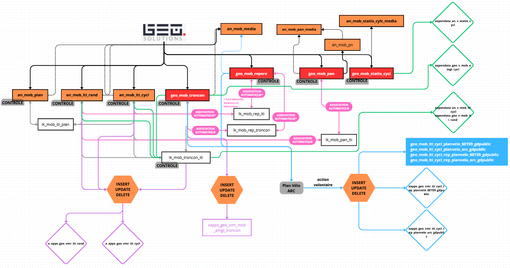
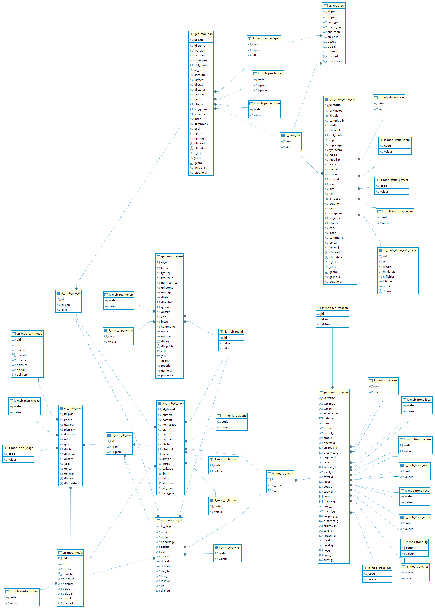

# Documentation d'administration de la base de données des mobilités douces #

## Principes
  * **généralité** :

En 2022, un nouveau cadre de mutualisation s'est ouvert avec l'accueil d'une nouvelle EPCI formant ainsi le territoire du Grand Compiégnois comprenant désormais 4 EPCI. Celui-ci a fait émerger l'envie de disposer d'une application sur la gestion des mobilités douces plus large que celle exitante, et surtout à destination des services mobilités. L'objectif est de laisser la gestion de l'information aux EPCI et plus au Service Information Géographique de l'Agglomération de la Région de Compiègne.

Cette application repose sur le développement d'une base de données partagée, stockée dans l'entrepôt de données du GéoCompiégnois, et à la fois étanche entre chaque EPCI.

L'application ainsi développée permet à chaque EPCI de disposer de ses propres données et de bénéficier des apports fonctionnels de tous. Elle permet également de visualiser les informations des autres EPCI afin d'assurer les continuités territoriales.
 
 * **résumé fonctionnel** :

Pour rappel des grands principes :

* le modèle de données et l'application répondent à un besoin de connaissance et de gestion des aménagements et du stationnement cyclables par les services mobilités de chaque intercommunalité
* la restitution des itinéraires (cyclables ou de randonnées) est intégré dans l'application à partir des tronçons aménagés et associés à des itinéraires
* restitution des informations pour alimentation de l'OpenData et de support de communications

## Schéma fonctionnel

## Modèle relationel simplifié

## Dépendances

Cette base de donnnées est dépendante de listes de valeurs contenues dans le schéma r_objet (lt_etat_avancement, lt_statut, lt_src_geom, lt_gestio_proprio, lt_booleen).

## Classes d'objets des mobilités douces

L'ensemble des classes d'objets de gestion sont stockés dans le schéma `m_mobilite_douce`.

### Classes d'objets géographique :

`[m_mobilite_douce].[geo_mob_pan]` : table géographique contenant la localisation des panneaux routiers et de signalétiques cyclables/randonnées
   
|Nom attribut | Définition | Type | Valeurs par défaut |
|:---|:---|:---|:---|
|id_pan|Identifiant unique interne|text|('P'::text || nextval('m_mobilite_douce.geo_mob_pan_seq'::regclass))|
|id_tronc|Identifiant du tronçon le plus proche|text| |
|typ_sign|Type de signalisation|character varying(2)|'00'::character varying|
|typ_pan|Type de panneau|character varying(2)|'00'::character varying|
|code_pan|Code officiel du panneau|character varying(50)|'00'::character varying|
|etat_mob|Etat du support|character varying(2)|'00'::character varying|
|an_pose|Année de pose|integer| |
|azimuth|Angle en degrés entre la direction du panneau dans son axe de lecture et le nord. Indique la direction vers laquelle l'information portée par le panneau s'applique.|integer| |
|rattach|Référence le tronçon de route sur lequel s'applique la directive inscrite sur le panneau.|text| |
|dbetat|Etat d'avancement (Niveau de réalisation) du panneau|character varying(2)|'40'::character varying|
|dbstatut|Statut du panneau|character varying(2)|'10'::character varying|
|proprio|Nom de l'organisme qui entretient le panneau|text|'00'::text|
|gestio|Nom de l'aménageur|text|'00'::text|
|observ|Commentaire(s)|character varying(1000)| |
|src_geom|Code du référentiel géographique utilisé pour la saisie|character varying(2)|'24'::character varying|
|src_annee|Année du référentiel géographique|character varying(4)|'2021'::character varying|
|insee|Code Insee  de la commune d'implantation du panneau|character varying(5)| |
|commune|Commune d'implantation du panneau|character varying(80)| |
|epci|EPCI d'assise du panneau|character varying(5)| |
|op_sai|Opérateur de saisie|character varying(50)| |
|op_maj|Opérateur de mise à jour|character varying(50)| |
|dbinsert|Date d'insertion dans la base de données|timestamp without time zone|now()|
|dbupdate|Date de mise à jour dans la base de données|timestamp without time zone| |
|x_l93|Coordonnées X en Lambert 93|numeric| |
|y_l93|Coordonnées Y en Lambert 93|numeric| |
|geom|Classe d'objets géométrique|point(2154)| |
|gestio_a|Libellé de l'autre aménageur (rempli uniquement si gestio = autre)|text| |
|proprio_a|Libellé de l'autre organisme d'entretien(rempli uniquement si proprio = autre)|text| |

Particularité(s) à noter :
* Une clé primaire existe sur le champ `id_pan` l'attribution automatique est composé d'un numéro séquentiel préfixé par la lettre 'P'. 
* Une clé étrangère existe sur la table de valeur `lt_mob_pan_codepan_fkey` (lien vers la liste de valeurs du type de panneau `lt_mob_pan_codepan`)
* Une clé étrangère existe sur la table de valeur `lt_mob_pan_dbetat_fkey` (lien vers la liste de valeurs de l'état d'avancement du panneau `lt_etat_avancement`)
* Une clé étrangère existe sur la table de valeur `lt_mob_pan_dbstatut_fkey` (lien vers la liste de valeurs le statut du panneau `lt_statut`)
* Une clé étrangère existe sur la table de valeur `lt_mob_pan_etat_fkey` (lien vers la liste de valeurs de l'état du panneau `lt_mob_etat`)
* Une clé étrangère existe sur la table de valeur `lt_mob_pan_srcgeom_fkey` (lien vers la liste de valeurs des sources de saisies géographiques `lt_src_geom`)
* Une clé étrangère existe sur la table de valeur `lt_mob_pan_typpan_fkey` (lien vers la liste de valeurs du type de panneau `lt_mob_pan_typ`)
* Une clé étrangère existe sur la table de valeur `lt_mob_pan_typsign_fkey` (lien vers la liste de valeurs du type de signalétique `lt_mob_pan_typsign`)

* 6 triggers :
  * `t_t1_100_log` : trigger permettant d'insérer toutes les modifications dans la table des logs
  * `t_t1_dbinsert` : trigger permettant d'insérer la date de saisie
  * `t_t2_dbupdate` : trigger permettant d'insérer la date de mise à jour
  * `t_t3_xyl93` : trigger permettant de calculer les coordonnées avant enregistrement
  *  `t_t5_autorite` : trigger permettant de récupérer la valeur de l'EPCI du profil utulisateur
  *  `t_t6_controle` : trigger permettant de contrôler la saisie et d'automatiser certaines valeurs à l'enregistrement 

 ---

`[m_mobilite_douce].[geo_mob_repere]` : table géographique contenant la localisation des repères cyclables/randonnées
   
|Nom attribut | Définition | Type | Valeurs par défaut |
|:---|:---|:---|:---|
|id_rep|Identifiant unique interne|text|('RC'::text || nextval('m_mobilite_douce.geo_mob_repere_seq'::regclass))|
|libelle|Numéro, nom ou description utilisé comme désignation du point de repère|character varying(255)| |
|typ_rep|Type de repère|character varying(2)|'00'::character varying|
|typ_rep_a|Autre type de repère (si typ_rep = autre)|character varying(255)| |
|num_compt|N° du compteur (si typ_rep = compteur)|text| |
|url_compt|URL d'accès aux statistiques du compteur (lien externe) (si typ_rep = compteur)|text| |
|usa_rep|Usage principal du repère|character varying(2)|'00'::character varying|
|dbetat|Etat d'avancement (Niveau de réalisation) du repère|character varying(2)|'40'::character varying|
|dbstatut|Statut du repère|character varying(2)|'10'::character varying|
|gestio|Aménageur|text|'00'::text|
|observ|Commentaire(s)|character varying(1000)| |
|epci|EPCI d'assise du repère|character varying(5)| |
|insee|Code Insee  de la commune d'implantation du repère|character varying(5)| |
|commune|Commune d'implantation du repère|character varying(80)| |
|op_sai|Opérateur de saisie|character varying(50)| |
|op_maj|Opérateur de mise à jour|character varying(50)| |
|dbinsert|Date d'insertion dans la base de données|timestamp without time zone|now()|
|dbupdate|Date de mise à jour dans la base de données|timestamp without time zone| |
|x_l93|Coordonnées X en Lambert 93|numeric| |
|y_l93|Coordonnées Y en Lambert 93|numeric| |
|geom|Classe d'objets géométrique|point(2154)| |
|proprio|Organisme qui entretient|text|'00'::text|
|gestio_a|Libellé de l'autre aménageur (rempli uniquement si gestio = autre)|text| |
|proprio_a|Libellé de l'autre organisme d'entretien(rempli uniquement si proprio = autre)|text| |

Particularité(s) à noter :
* Une clé primaire existe sur le champ `id_rep` l'attribution automatique composé d'un numéro séquentiel préfixé par la lettre 'R'
* Une clé étrangère existe sur la table de valeur `lt_mob_pan_dbetat_fkey` (lien vers la liste de valeurs de l'état d'avancement du panneau `lt_etat_avancement`)
* Une clé étrangère existe sur la table de valeur `lt_mob_pan_dbstatut_fkey` (lien vers la liste de valeurs le statut du panneau `lt_statut`)
* Une clé étrangère existe sur la table de valeur `lt_mob_rep_typrep_fkey` (lien vers la liste de valeurs du type de repère `lt_mob_rep_typr`)
* Une clé étrangère existe sur la table de valeur `lt_mob_rep_usarep_fkey` (lien vers la liste de valeurs de l'usage du repère `lt_mob_rep_usar`)

* 6 triggers :
  * `t_t1_100_log` : trigger permettant d'insérer toutes les modifications dans la table des logs
  * `t_t1_dbinsert` : trigger permettant d'insérer la date de saisie
  * `t_t2_dbupdate` : trigger permettant d'insérer la date de mise à jour
  * `t_t3_xyl93` : trigger permettant de calculer les coordonnées avant enregistrement
  *  `t_t5_autorite` : trigger permettant de récupérer la valeur de l'EPCI du profil utulisateur
  *  `t_t6_controle` : trigger permettant de contrôler la saisie et d'automatiser certaines valeurs à l'enregistrement 

 ---

 `[m_mobilite_douce].[geo_mob_statio_cycl]` : table géographique contenant la localisation des stationnements cyclables
   
|Nom attribut | Définition | Type | Valeurs par défaut |
|:---|:---|:---|:---|
|id_statio|Identifiant unique interne|text|('SC'::text || nextval('m_mobilite_douce.geo_mob_statio_cycl_seq'::regclass))|
|id_adresse|Identifiant de l'adresse|bigint| |
|id_voie|Identifiant de la voie|bigint| |
|complt_adr|Complément d'adresse|character varying(500)| |
|dbetat|Niveau d'avancement de l'équipement|character varying(2)|'40'::character varying|
|dbstatut|Statut de l'équipement|character varying(2)|'10'::character varying|
|etat_mob|Etat physique de l'équipement|character varying(2)|'10'::character varying|
|cap|Nombre de places de stationnement disponibles sur l'emplacement y compris les places adaptées à des vélos spéciaux|smallint|0|
|cap_cargo|Nombre de places de stationnement disponibles pour les vélos de grande taille|smallint| |
|typ_accro|Mode d'accrochage possible du vélo aux équipements de stationnement|character varying(2)|'00'::character varying|
|mobil|Type de mobilier de stationnement|character varying(2)|'00'::character varying|
|mobil_p|Précision sur le type de mobilier de stationnement|character varying(50)| |
|acces|Mode d'accès à l'emplacement de stationnement|character varying(2)|'00'::character varying|
|gratuit|L'usage de l'équipement de stationnement est-il gratuit ?|character varying(2)|'00'::character varying|
|protect|Protection du stationnement|character varying(2)|'00'::character varying|
|couvert|Le stationnement est-il couvert et est donc protégé de la pluie, de la neige et de la grêle ?|character varying(1)|'0'::character varying|
|surv|Le stationnement est-il surveillé par un gardien ou par de la vidéosurveillance ?|character varying(1)|'0'::character varying|
|lum| L'emplacement est-il éclairé la nuit (par de l'éclairage urbain ou dédié à l'emplacement) ?|character varying(1)|'0'::character varying|
|url|Site web d'information|text| |
|an_pose|Année de mise en service du stationnement vélo|integer| |
|proprio|Nom de l'organisme qui entretient|text|'00'::character varying|
|gestio|Nom de l'aménageur|text|'00'::text|
|src_geom|Référentiel géographique de saisie|character varying(2)|'24'::character varying|
|src_annee|Année du référentiel de saisie|character varying(4)|'2021'::character varying|
|observ|Commentaire(s)|character varying(1000)| |
|epci|EPCI d'assise de l'équipement|character varying(5)| |
|insee|Code Insee  de la commune d'implantation de l'équipement|character varying(5)| |
|commune|Commune d'implantation de l'équipement|character varying(80)| |
|op_sai|Opérateur de saisie|character varying(50)| |
|op_maj|Opérateur de mise à jour|character varying(50)| |
|dbinsert|Date d'insertion dans la base de données|timestamp without time zone|now()|
|dbupdate|Date de mise à jour dans la base de données|timestamp without time zone| |
|x_l93|Coordonnées X en Lambert 93|numeric| |
|y_l93|Coordonnées Y en Lambert 93|numeric| |
|geom|Classe d'objets géométrique|point(2154)| |
|gestio_a|Libellé de l'autre aménageur (rempli uniquement si gestio = autre)|text| |
|proprio_a|Libellé de l'autre organisme d'entretien(rempli uniquement si proprio = autre)|text| |

Particularité(s) à noter :
* Une clé primaire existe sur le champ `id_statio` l'attribution automatique composé d'un numéro séquentiel préfixé par la lettre 'SC'
* Une clé étrangère existe sur la table de valeur `lt_mob_statio_acces_fkey` (lien vers la liste de valeurs de l'état d'avancement du panneau `lt_mob_statio_acces`)
* Une clé étrangère existe sur la table de valeur `lt_mob_statio_couvert_fkey` (lien vers la liste de valeurs si couvert `r_objet.lt_booleen`)
* Une clé étrangère existe sur la table de valeur `lt_mob_statio_dbetat_fkey` (lien vers la liste de valeurs de l'état d'avancement `lt_etat_avancement`)
* Une clé étrangère existe sur la table de valeur `lt_mob_statio_dbstatut_fkey` (lien vers la liste de valeurs du statut `r_objet.lt_statut`)
* Une clé étrangère existe sur la table de valeur `lt_mob_statio_etat_mob_fkey` (lien vers la liste de valeurs de l'état du mobilier `lt_mob_etat`)
* Une clé étrangère existe sur la table de valeur `lt_mob_statio_gestio_fkey` (lien vers la liste de valeurs de l'aménageur `r_objet.lt_gestio_proprio`)
* Une clé étrangère existe sur la table de valeur `lt_mob_statio_gratuit_fkey` (lien vers la liste de valeurs sur la gratuité ` r_objet.lt_booleen`)
* Une clé étrangère existe sur la table de valeur `lt_mob_statio_lum_fkey` (lien vers la liste de valeurs sur la présence de l'éclairage ` r_objet.lt_booleen`)
* Une clé étrangère existe sur la table de valeur `lt_mob_statio_mobil_fkey` (lien vers la liste de valeurs du type de mobilier `lt_mob_statio_mobil`)
* Une clé étrangère existe sur la table de valeur `lt_mob_statio_proprio_fkey` (lien vers la liste de valeurs sur l'organisme d'entretien `r_objet.lt_gestio_proprio`)
* Une clé étrangère existe sur la table de valeur `lt_mob_statio_protect_fkey` (lien vers la liste de valeurs sur le présence d'une protection `lt_mob_statio_protect`)
* Une clé étrangère existe sur la table de valeur `lt_mob_statio_surv_fkey` (lien vers la liste de valeurs si un surveillance existe ` r_objet.lt_booleen`)
* Une clé étrangère existe sur la table de valeur `lt_mob_statio_typ_accro_fkey` (lien vers la liste de valeurs sur le type d'accroche `lt_mob_statio_typ_accro`)
* Une clé étrangère existe sur la table de valeur `lt_mob_station_srcgeom_fkey` (lien vers la liste de valeurs des sources de saisies `r_objet.lt_src_geom`)

* 6 triggers :
  * `t_t0_controle` : trigger permettant de contrôler la saisie et d'automatiser certaines valeurs à l'enregistrement 
  * `t_t1_100_log` : trigger permettant d'insérer toutes les modifications dans la table des logs
  * `t_t1_dbinsert` : trigger permettant d'insérer la date de saisie
  * `t_t2_dbupdate` : trigger permettant d'insérer la date de mise à jour
  * `t_t3_xyl93` : trigger permettant de calculer les coordonnées avant enregistrement
  * `t_t4_inseecommune` : trigger permettant de récupérer la valeur du code insee et le nom de la commune d'assise du stationnement
  * `t_t5_autorite` : trigger permettant de récupérer la valeur de l'EPCI du profil utulisateur

 ---

  `[m_mobilite_douce].[geo_mob_troncon]` : table géographique contenant la localisation des aménagements cyclables
   
|Nom attribut | Définition | Type | Valeurs par défaut |
|:---|:---|:---|:---|
|id_tronc|Identifiant unique interne|text|('TC'::text || nextval('m_mobilite_douce.geo_mob_troncon_seq'::regclass))|
|typ_mob|Type de mobilité douce|character varying(2)|'10'::character varying|
|typ_res|Type de réseau structurant local auquel appartient l'aménagement|character varying(2)|'00'::character varying|
|acces_ame|Accessibilité des aménagements par type de véhicule à deux roues non motorisé (hiérarchisation, si ROLLER, les autres possibles)|character varying(2)|'00'::character varying|
|trafic_vit|Vitesse maximale autorisée pour le trafic adjacent à l'aménagement, en km/h. La vitesse 5 km/h correspond à une vitesse à l'allure du pas|integer| |
|lum|Présence d'éclairage|character varying(1)|'0'::character varying|
|dbstatut|Statut de l'aménagement|character varying(2)|'10'::character varying|
|posi_dg|Indique les informations à remplir selon que l'aménagement est à droite à gauche ou les deux|character varying(2)|'10'::character varying|
|ame_d|Type d'aménagement de droite|character varying(2)| |
|dbetat_d|Etat d'avancement (Niveau de réalisation) de l'aménagement de droite|character varying(2)|'00'::character varying|
|an_prog_d|Année de programmation de l'aménagement de droite|integer| |
|d_service_d|Année de mise en service de l'aménagement de droite|integer| |
|regime_d|Régime présent sur la voie de droite|character varying(2)|'00'::character varying|
|sens_d|Sens de circulation de l'aménagement de droite|character varying(2)|'00'::character varying|
|largeur_d|Largeur de l'aménagement de droite (en mètre)|double precision| |
|local_d|Localisation de l'aménagement de droite|character varying(2)|'00'::character varying|
|revet_d|Niveau de qualité du revêtement de l'aménagement de droite qualifié par rapport à la pratique du vélo|character varying(2)|'00'::character varying|
|lin_d|Linéaire en mètre du tronçon de droite|integer| |
|cout_d|Coût en euro HT de l'aménagement de droite (attribut plus utilisé et masqué dans l'application)|integer| |
|subv_d|Subvention reçu en euro HT de l'aménagement de droite (attribut plus utilisé et masqué dans l'application)|integer| |
|com_g|Information sur le fait que la commune de gauche soit la même que la commune de droite|boolean|true|
|mame_g|Information sur le fait que l'aménagement de gauche soit la même que l'aménagement de droite|boolean|true|
|ame_g|Type d'aménagement de gauche|character varying(2)| |
|dbetat_g|Etat d'avancement (Niveau de réalisation) de l'aménagement de gauche|character varying(2)|'00'::character varying|
|an_prog_g|Année de programmation de l'aménagement de gauche|integer| |
|d_service_g|Année de mise en service de l'aménagement de gauche|integer| |
|regime_g|Régime présent sur la voie de gauche|character varying(2)|'00'::character varying|
|sens_g|Sens de circulation de l'aménagement de gauche|character varying(2)|'00'::character varying|
|largeur_g|Largeur de l'aménagement de gauche (en mètre)|double precision| |
|local_g|Localisation de l'aménagement de gauche|character varying(2)|'00'::character varying|
|revet_g|Niveau de qualité du revêtement de l'aménagement de gauche qualifié par rapport à la pratique du vélo|character varying(2)|'00'::character varying|
|lin_g|Linéaire en mètre du tronçon de gauche|integer| |
|cout_g|Coût en euro HT de l'aménagement de gauche (attribut plus utilisé et masqué dans l'application)|integer| |
|subv_g|Subvention reçu en euro HT de l'aménagement de gauche (attribut plus utilisé et masqué dans l'application)|integer| |
|proprio_d|Nom de l'organisation qui entretient l'aménagement de droite|text|'00'::character varying|
|gestio_d|Nom de l'aménageur de l'aménagement de droite|text|'00'::text|
|proprio_g|Nom de l'organisation qui entretient l'aménagement de gauche|text|'00'::character varying|
|gestio_g|Nom de l'aménageur de l'aménagement de gauche|text|'00'::text|
|conv_d|Tronçon de l'aménagement de droite sous convention de gestion|character varying(1)|'f'::character varying|
|conv_g|Tronçon de l'aménagement de gauche sous convention de gestion|character varying(1)|'f'::character varying|
|src_geom|Code du référentiel géographique utilisé pour la saisie|character varying(2)|'24'::character varying|
|src_annee|Année du référentiel géographique|character varying(4)|'2021'::character varying|
|observ|Commentaires divers|character varying(1000)| |
|op_sai|Opérateur de la saisie de la donnée|character varying(50)| |
|op_maj|Opérateur de la dernière mise à jour de la donnée|character varying(50)| |
|dbinsert|date de saisie de la donnée|timestamp without time zone|now()|
|dbupdate|date de mise à jour de la donnée|timestamp without time zone| |
|insee_d|Libellé de la commune de l'aménagement de droite|character varying(5)| |
|commune_d|Libellé de la commune de l'aménagement de droite|character varying(80)| |
|epci_d|EPCI d'assise de l'aménagement de droite|character varying(5)| |
|insee_g|Libellé de la commune de l'aménagement de gauche|character varying(5)| |
|commune_g|Libellé de la commune de l'aménagement de gauche|character varying(80)| |
|epci_g|EPCI d'assise de l'aménagement de gauche|character varying(5)| |
|epci|EPCI de saisie de l'aménagement|character varying(5)| |
|geom|Géométrie des objets saisis|multilinestring(2154)| |
|requal_g|Attribut permettant de de signaler une requalification de l'aménagement de gauche existant|boolean|false|
|requal_d|Attribut permettant de de signaler une requalification de l'aménagement de droite existant|boolean|false|
|reqame_g|Nouvel aménagement projeté à gauche après requalification|character varying(2)|'ZZ'::character varying|
|reqame_d|Nouvel aménagement projeté à droite après requalification|character varying(2)|'ZZ'::character varying|
|reqam_dbetat_g|Etat d'avancement du nouvel aménagement projeté à gauche après requalification|character varying(2)|'ZZ'::character varying|
|reqam_dbetat_d|Etat d'avancement du nouvel aménagement projeté à gauche après requalification|character varying(70)|'ZZ'::character varying|
|gestio_a_d|Libellé de l'autre aménageur à droite (rempli uniquement si gestio = autre)|text| |
|gestio_a_g|Libellé de l'autre aménageur à gauche (rempli uniquement si gestio = autre)|text| |
|proprio_a_d|Libellé de l'autre organisme d'entretien à droite (rempli uniquement si proprio = autre)|text| |
|proprio_a_g|Libellé de l'autre organisme d'entretien à gauche (rempli uniquement si proprio = autre)|text| |

Particularité(s) à noter :
* Une clé primaire existe sur le champ `id_tronc` l'attribution automatique composé d'un numéro séquentiel préfixé par la lettre 'TC'
* Une clé étrangère existe sur la table de valeur `lt_etat_avancement_dbetat_d_requal_fkey` (lien vers la liste de valeurs de l'état d'avancement de la requalification du tronçon de droite `lt_etat_avancement`)
* Une clé étrangère existe sur la table de valeur `lt_etat_avancement_dbetat_g_requal_fkey` (lien vers la liste de valeurs de l'état d'avancement de la requalification du tronçon de gauche `lt_etat_avancement`)
* Une clé étrangère existe sur la table de valeur `lt_mob_tronc_acces_fkey` (lien vers la liste de valeurs du type d'accéssibilité `lt_mob_tronc_acces`)
* Une clé étrangère existe sur la table de valeur `lt_mob_tronc_ame_d_fkey` (lien vers la liste de valeurs du type d'aménagement du tronçon de droite `lt_mob_tronc_ame`)
* Une clé étrangère existe sur la table de valeur `lt_mob_tronc_ame_d_requal_fkey` (lien vers la liste de valeurs de l'aménagement en requalification du tronçon de droite `lt_mob_tronc_ame`)
* Une clé étrangère existe sur la table de valeur `lt_mob_tronc_ame_g_fkey` (lien vers la liste de valeurs du type d'aménagement du tronçon de gauche `lt_mob_tronc_ame`)
* Une clé étrangère existe sur la table de valeur `lt_mob_tronc_ame_g_requal_fkey` (lien vers la liste de valeurs de l'aménagement en requalification du tronçon de gauche `lt_mob_tronc_ame`)
* Une clé étrangère existe sur la table de valeur `lt_mob_tronc_conv_d_fkey` (lien vers la liste de valeurs booléen de l'aménagement de droite sous convention de gestion`lt_booleen`)
* Une clé étrangère existe sur la table de valeur `lt_mob_tronc_conv_g_fkey` (lien vers la liste de valeurs booléen de l'aménagement de gauche sous convention de gestion`lt_booleen`)
* Une clé étrangère existe sur la table de valeur `lt_mob_tronc_dbetat_d_fkey` (lien vers la liste de valeurs de l'état d'avancement de l'aménagement de droite `lt_etat_avancement`)
* Une clé étrangère existe sur la table de valeur `lt_mob_tronc_dbetat_g_fkey` (lien vers la liste de valeurs de l'état d'avancement de l'aménagement de gauche `lt_etat_avancement`)
* Une clé étrangère existe sur la table de valeur `lt_mob_tronc_dbstatut_fkey` (lien vers la liste de valeurs du statut du tronçon `lt_statut`)
* Une clé étrangère existe sur la table de valeur `lt_mob_tronc_local_d_fkey` (lien vers la liste de valeurs de la localisation du tronçon de droite `lt_mob_tronc_local`)
* Une clé étrangère existe sur la table de valeur `lt_mob_tronc_local_g_fkey` (lien vers la liste de valeurs de la localisation du tronçon de gauche `lt_mob_tronc_local`)
* Une clé étrangère existe sur la table de valeur `lt_mob_tronc_lum_fkey` (lien vers la liste de valeurs booléen sur la présence de lumière sur le tronçon `lt_booleen`)
* Une clé étrangère existe sur la table de valeur `lt_mob_tronc_posi_dg_fkey` (lien vers la liste de valeurs de la position de l'aménagement (à droite, à gauche ou les deux) `lt_mob_tronc_posi`)
* Une clé étrangère existe sur la table de valeur `lt_mob_tronc_regime_d_fkey` (lien vers la liste de valeurs du regime de circulation du tronçon de droite `lt_mob_tronc_regime`)
* Une clé étrangère existe sur la table de valeur `lt_mob_tronc_regime_g_fkey` (lien vers la liste de valeurs du regime de circulation du tronçon de gauche `lt_mob_tronc_regime`)
* Une clé étrangère existe sur la table de valeur `lt_mob_tronc_res_fkey` (lien vers la liste de valeurs dy type de réseau cyclable `lt_mob_tronc_res`)
* Une clé étrangère existe sur la table de valeur `lt_mob_tronc_revet_d_fkey` (lien vers la liste de valeurs du type de revêtement du tronçon de droite `lt_mob_tronc_revet`)
* Une clé étrangère existe sur la table de valeur `lt_mob_tronc_revet_g_fkey` (lien vers la liste de valeurs du type de revêtement du tronçon de gauche `lt_mob_tronc_revet`)
* Une clé étrangère existe sur la table de valeur `lt_mob_tronc_sens_d_fkey` (lien vers la liste de valeurs du sens de circulation du tronçon de droite `lt_mob_tronc_sens`)
* Une clé étrangère existe sur la table de valeur `lt_mob_tronc_sens_g_fkey` (lien vers la liste de valeurs du sens de circulation du tronçon de gauche `lt_mob_tronc_sens`)
* Une clé étrangère existe sur la table de valeur `lt_mob_tronc_src_geom_fkey` (lien vers la liste de valeurs de la source du référentiel géographique de saisie `lt_src_geom`)
* Une clé étrangère existe sur la table de valeur `lt_mob_tronc_typ_fkey` (lien vers la liste de valeurs du type de tronçon (cyclable ou randonnée) `lt_mob_tronc_typ`)  

* 6 triggers :
  * `t_t0_controle` : trigger permettant de contrôler la saisie et d'automatiser certaines valeurs à l'enregistrement 
  * `t_t1_100_log` : trigger permettant d'insérer toutes les modifications dans la table des logs
  * `t_t10_after_decoupe` : trigger permettant de gérer la découpe 
  * `t_t1_dbinsert` : trigger permettant d'insérer la date de saisie
  * `t_t2_dbupdate` : trigger permettant d'insérer la date de mise à jour
  * `t_t5_autorite` : trigger permettant de récupérer la valeur de l'EPCI du profil utulisateur
  * `t_t7_majpan_rep` : trigger permettant de gérer les associations des panneaux et repères aux tronçons
  * `t_t8_refresh_iti` : trigger permettant de rafraîchir les itinéraires après modification

---

`[m_mobilite_douce].[geo_mob_regroup]` : Classe d'objet géographique localisant les regroupemenrts d'équipements pour vélo
   
|Nom attribut | Définition | Type | Valeurs par défaut |
|:---|:---|:---|:---|
|id_regroup|Identifiant unique interne|text|('RV'::text || nextval('m_mobilite_douce.geo_mob_regroup_seq'::regclass))|
|nom|nom de l'aire de service ou de la halte repos|text| |
|importance|indique l'importance du pôle|character varying(2)|'00'::character varying|
|nb_equip|nombre d'équipements faisant partis du regroupement|integer| |
|dbetat|Niveau d'avancement de l'équipement|character varying(2)|'40'::character varying|
|dbstatut|Statut de l'équipement|character varying(2)|'10'::character varying|
|proprio|Nom de l'organisme qui entretient|text|'00'::character varying|
|gestio|Nom de l'aménageur|text|'00'::text|
|gestio_a|Libellé de l'autre aménageur (rempli uniquement si gestio = autre)|text| |
|proprio_a|Libellé de l'autre organisme d'entretien(rempli uniquement si proprio = autre)|text| |
|src_geom|Référentiel géographique de saisie|character varying(2)|'24'::character varying|
|src_annee|Année du référentiel de saisie|character varying(4)|'2023'::character varying|
|observ|Commentaire(s)|character varying(1000)| |
|epci|EPCI d'assise de l'équipement|character varying(5)| |
|insee|Code Insee  de la commune d'implantation de l'équipement|character varying(5)| |
|commune|Commune d'implantation de l'équipement|character varying(80)| |
|op_sai|Opérateur de saisie|character varying(50)| |
|op_maj|Opérateur de mise à jour|character varying(50)| |
|dbinsert|Date d'insertion dans la base de données|timestamp without time zone|now()|
|dbupdate|Date de mise à jour dans la base de données|timestamp without time zone| |
|geom|Classe d'objets géométrique|geometry(multipolygon, 2154)| |

Particularité(s) à noter :
* Une clé primaire existe sur le champ `id_regroup` l'attribution automatique composé d'un numéro séquentiel préfixé par la lettre 'RV'
* Une clé étrangère existe sur la table de valeur `lt_mob_regroup_dbetat_fkey` (lien vers la liste de valeurs de l'état d'avancement `lt_etat_avancement`)
* Une clé étrangère existe sur la table de valeur `lt_mob_regroup_dbstatut_fkey` (lien vers la liste de valeurs du statut `lt_statut`)
* Une clé étrangère existe sur la table de valeur `lt_mob_regroup_import_fkey` (lien vers la liste de valeurs de l'importance du regroupement `lt_mob_regroup_imp`)
* Une clé étrangère existe sur la table de valeur `lt_mob_regroup_srcgeom_fkey` (lien vers la liste de valeurs de la source du référentiel géographique de saisie `lt_src_geom`)

* 6 triggers :
  * `t_t0_controle` : trigger permettant de contrôler la saisie et d'automatiser certaines valeurs à l'enregistrement 
  * `t_t1_100_log` : trigger permettant d'insérer toutes les modifications dans la table des logs
  * `t_t1_dbinsert` : trigger permettant d'insérer la date de saisie
  * `t_t2_dbupdate` : trigger permettant d'insérer la date de mise à jour
  * `t_t4_inseecommune` : trigger permettant de récupérer les codes insee et le nom de la commune
  * `t_t5_autorite` : trigger permettant de récupérer la valeur de l'EPCI du profil utulisateur
  * `t_t7_regroup_before` : trigger permettant de calculer le nombre d'équipements présents dans le regroupement et d'affecter l'id_regroupement aux équipements

---

`[m_mobilite_douce].[geo_mob_equip_velo]` : Classe d'objet géographique localisant les équipements vélos (hors stationnement)
   
|Nom attribut | Définition | Type | Valeurs par défaut |
|:---|:---|:---|:---|
|id_eqvelo|Identifiant unique interne|text|('EQ'::text || nextval('m_mobilite_douce.geo_mob_equip_velo_seq'::regclass))|
|id_regroupement|identifiant de l'aire de service ou de la halte repos auquel appartient l'équipement|text| |
|type_equip|type d'équipement|character varying(2)| |
|ss_type_equip|Sous-type d'équipement|character varying(2)| |
|dbetat|Niveau d'avancement de l'équipement|character varying(2)|'40'::character varying|
|dbstatut|Statut de l'équipement|character varying(2)|'10'::character varying|
|etat_mob|état d’entretien de l'équipement|character varying(2)|'10'::character varying|
|protect|définit le type de protection de l'équipement|character varying(2)|'00'::character varying|
|couvert|caractéristique des lieux de restauration (table de pique-nique) et des stationnements vélo : abrité ou non|character varying(1)|'0'::character varying|
|payant|information sur le caractère  payant pour les équipements spécifiques : sanitaires, stationnement vélo longue durée, consigne bagage sécurisée|character varying(1)|'0'::character varying|
|acces_pmr|accessibilité PMR|character varying(1)|'0'::character varying|
|proprio|Nom de l'organisme qui entretient|text|'00'::character varying|
|gestio|Nom de l'aménageur|text|'00'::text|
|gestio_a|Libellé de l'autre aménageur (rempli uniquement si gestio = autre)|text| |
|proprio_a|Libellé de l'autre organisme d'entretien(rempli uniquement si proprio = autre)|text| |
|src_geom|Référentiel géographique de saisie|character varying(2)|'24'::character varying|
|src_annee|Année du référentiel de saisie|character varying(4)|'2023'::character varying|
|observ|Commentaire(s)|character varying(1000)| |
|epci|EPCI d'assise de l'équipement|character varying(5)| |
|insee|Code Insee  de la commune d'implantation de l'équipement|character varying(5)| |
|commune|Commune d'implantation de l'équipement|character varying(80)| |
|op_sai|Opérateur de saisie|character varying(50)| |
|op_maj|Opérateur de mise à jour|character varying(50)| |
|dbinsert|Date d'insertion dans la base de données|timestamp without time zone|now()|
|dbupdate|Date de mise à jour dans la base de données|timestamp without time zone| |
|x_l93|Coordonnées X en Lambert 93|numeric| |
|y_l93|Coordonnées Y en Lambert 93|numeric| |
|geom|Classe d'objets géométrique|geometry(point, 2154)| |

Particularité(s) à noter :
* Une clé primaire existe sur le champ `id_eqvelo` l'attribution automatique composé d'un numéro séquentiel préfixé par la lettre 'EQ'
* Une clé étrangère existe sur la table de valeur `lt_mob_regroup_dbetat_fkey` (lien vers la liste de valeurs de l'état d'avancement `lt_etat_avancement`)
* Une clé étrangère existe sur la table de valeur `lt_mob_regroup_dbstatut_fkey` (lien vers la liste de valeurs du statut `lt_statut`)
* Une clé étrangère existe sur la table de valeur `lt_mob_eqvelo_accespmr_fkey` (lien vers la liste de valeurs du booléen `lt_booleen`)
* Une clé étrangère existe sur la table de valeur `lt_mob_eqvelo_couvert_fkey` (lien vers la liste de valeurs du booléen `lt_booleen`)
* Une clé étrangère existe sur la table de valeur `lt_mob_eqvelo_etat_mob_fkey` (lien vers la liste de valeurs de l'état du mobilier `lt_mob_etat`)
* Une clé étrangère existe sur la table de valeur `lt_mob_eqvelo_payant_fkey` (lien vers la liste de valeurs du booléen `lt_booleen`)
* Une clé étrangère existe sur la table de valeur `lt_mob_eqvelo_protect_fkey` (lien vers la liste de valeurs des types de protection `lt_mob_statio_protect`)
* Une clé étrangère existe sur la table de valeur `lt_mob_eqvelo_srcgeom_fkey` (lien vers la liste de valeurs de la source du référentiel géographique de saisie `lt_src_geom`)
* Une clé étrangère existe sur la table de valeur `lt_mob_eqvelo_sstype_fkey` (lien vers la liste de valeurs des sous-types d'équipements `lt_mob_eqvelo_sstype`)
* Une clé étrangère existe sur la table de valeur `lt_mob_eqvelo_type_fkey` (lien vers la liste de valeurs des types d'équipements `lt_mob_eqvelo_type`) 

* 6 triggers :
  * `t_t0_controle` : trigger permettant de contrôler la saisie et d'automatiser certaines valeurs à l'enregistrement 
  * `t_t1_100_log` : trigger permettant d'insérer toutes les modifications dans la table des logs
  * `t_t1_dbinsert` : trigger permettant d'insérer la date de saisie
  * `t_t2_dbupdate` : trigger permettant d'insérer la date de mise à jour
  * `t_t3_xyl93` : trigger permettant d'insérer les coordonnées X et Y en Lambert 93
  * `t_t4_inseecommune` : trigger permettant de récupérer les codes insee et le nom de la commune
  * `t_t5_autorite` : trigger permettant de récupérer la valeur de l'EPCI du profil utulisateur
  * `t_t6_regroup` : trigger permettant de rechercher le regroupement d'appartenance de l'équipement et d'insérer l'id_regroupement
  * `t_t7_regroup_after` : trigger permettant de calculer le nombre d'équipements présents dans le regroupement et de mettre à jour la table `geo_mob_regroup`

---

`[m_mobilite_douce].[xapps_geo_vmr_mob_amgt_troncon]` : table géographique applicative contenant les informations des tronçons pour l'affichage cartographique (tronçon aménagé décalé, état et requalification). Cette table est alimentée par les différents triggers positionnés sur la table `geo_mob_troncon` et `lk_mob_tronc_iti`.
   
|Nom attribut | Définition | Type | Valeurs par défaut |
|:---|:---|:---|:---|
|gid|Identifiant interne (séquence)|bigint| |
|id_tronc|Identifiant du tronçon|text| |
|ame|Type d'aménagement|character varying(2)| |
|dbetat|Etat d'avancement|character varying(2)| |
|dbstatut|Statut|character varying(2)| |
|typ_mob|Type de mobilité|character varying(2)| |
|regime|Régime de circulation|character varying(2)| |
|local|Localisation|character varying(2)| |
|requal|Requalification|boolean| |
|gestio|Aménageur|text| |
|proprio|Entretien|text| |
|lib_gestio|Autre aménageur|text| |
|lib_proprio|Autre entretien|text| |
|epci|EPCI de droit|character varying(5)| |
|observ|Observations|character varying(1000)| |
|code_iditicycl|Code des itinéraires cyclables empruntant le tronçon|text| |
|code_iditirand|Code des itinéraires de randonnées empruntant le tronçon|text| |
|code_idplan|Code du plan d'aménagement à l'initiative de l'itinéraire auquel appartient le tronçon|text| |
|geom|Géométrie des tronçons décalés ou non|multilinestring(2154)| |

### Classes d'objets attributaire :

`[m_mobilite_douce].[an_mob_iti_cycl]` : table alphanumérique contenant les itinéraires cyclables
   
|Nom attribut | Définition | Type | Valeurs par défaut |
|:---|:---|:---|:---|
|id_iticycl|Identifiant unique interne|text|uuid_generate_v4()|
|numero|Numérotation de l'itinéraire|character varying(20)| |
|nomoff|Nom officiel de l'itinéraire, à défaut celui présent sur les document de communication|character varying(255)| |
|nomusage|Autre nom ou appellation de l’itinéraire en usage|character varying(255)| |
|depart|Nom de la localité située au départ de l'itinéraire|character varying(255)| |
|arrivee|Nom de la localité située à l’arrivée de l'itinéraire|character varying(255)| |
|dbetat|Etat d'avancement (Niveau d'avancement) de l'itinéraire|character varying(2)|'40'::character varying|
|dbstatut|Statut de l'itinéraire|character varying(2)|'10'::character varying|
|usa_iti|Usage principale de l'itinéraire|character varying(2)|'00'::character varying|
|lieu_d|Principaux lieux desservis|text| |
|instruc|Description détaillée (pas à pas) du tracé de l'itinéraire|text| |
|url|Référence du site internet faisant la promotion de l'itinéraire|character varying(255)| |
|d_prog|Année de programmation de l'itinéraire|integer| |
|d_service|Année d'ouverture de l'itinéraire|integer| |
|p_long|Longueur prévisionnel|integer| |
|p_ame|Aménagement prévisionnel|text|'00'::text|
|p_mao|MAO du projet|text|'00'::text|
|p_coutm|Coût estimatif au mètre linéaire|integer| |
|p_cout|Coût total du projet|integer| |
|gestio|Nom de l'aménageur|text|'00'::text|
|itivar|Variante d'un itinéraire maître|boolean|false|
|id_itivar|Identifiant de l'itinéraire maître|text| |
|n_itivar|Libellé de la variante|character varying(255)| |
|observ|Commentaire(s)|character varying(1000)| |
|epci|EPCI d'assise de l'itinértaire|text| |
|maj_geom|Attribut volatile permettant d'activer ou non la mise à jour de la géométrie dans la partie GdPublic|boolean|false|
|maj_att|Attribut volatile permettant d'activer ou non la mise à jour des modifications attributaires dans la partie GdPublic|boolean|false|
|sup_gdpublic|Attribut volatile permettant de supprimer un itinéraire dans la partie GdPublic|boolean|false|
|op_sai|Opérateur de saisie|character varying(50)| |
|op_maj|Opérateur de mise à jour|character varying(50)| |
|dbinsert|Date d'insertion dans la base de données|timestamp without time zone|now()|
|dbupdate|Date de mise à jour dans la base de données|timestamp without time zone| |
|proprio|Organisme quii entretient l'itinéraire|text|'00'::text|
|p_subv|Subvention totale reçue pour l'itinéraire|integer| |
|gestio_a|Libellé de l'autre aménageur (rempli uniquement si gestio = autre)|text| |
|proprio_a|Libellé de l'autre organisme d'entretien(rempli uniquement si proprio = autre)|text| |

Particularité(s) à noter :
* Une clé primaire existe sur le champ `id_iticycl` l'attribution automatique de la référence par un identifiant de type UUID V4. 
* Une clé étrangère existe sur la table de valeur `lt_mob_iti_dbetat_fkey`  (lien vers la liste de valeurs de l'état d'avancement de l'itinéraire `lt_etat_avancement`)
* Une clé étrangère existe sur la table de valeur `lt_mob_iti_dbstatut_fkey` (lien vers la liste de valeurs du statut de l'itinéraire `lt_statut`)
* Une clé étrangère existe sur la table de valeur `lt_mob_iti_usage_fkey` (lien vers la liste de valeurs de l'usage de l'usage `lt_mob_iti_usage`)

* 6 triggers :
  * `t_t0_controle` : trigger permettant de contrôler la saisie utilisateur et l'enregistrement de certaines valeurs
  * `t_t1_100_log` : trigger permettant d'insérer toutes les modifications dans la table des logs
  * `t_t1_dbinsert` : trigger permettant d'insérer la date de saisie
  * `t_t2_dbupdate` : trigger permettant d'insérer la date de mise à jour
  * `t_t5_autorite` : trigger permettant de récupérer la valeur de l'EPCI du profil utulisateur
  * `t_t8_refresh_iti` : trigger permettant de rafraîchir les itinéraires après modification
  * `t_t91_planvelo` : trigger permettant de gérer la mise à jour des données pour l'affichage dans le plan vélo de l'ARC
  * `t_t9_droit_delegue` : trigger permettant de gérer les droits délégués des itinéraires partagés entre plusieurs EPCI
---

`[m_mobilite_douce].[an_mob_iti_rand]` : table alphanumérique contenant les itinéraires de randonnées
   
|Nom attribut | Définition | Type | Valeurs par défaut |
|:---|:---|:---|:---|
|id_itirand|Identifiant unique interne|text|uuid_generate_v4()|
|numero|Numérotation de l'itinéraire|character varying(10)| |
|nomoff|Nom officiel de l'itinéraire, à défaut celui présent sur les document de communication|character varying(255)| |
|nomusage|Autre nom ou appellation de l’itinéraire en usage|character varying(255)| |
|prat_iti|Pratique de l'itinéraire|character varying(2)|'10'::character varying|
|typ_iti|Type d'itinéraire|character varying(2)|'00'::character varying|
|typ_parc|Type de parcours|character varying(2)|'00'::character varying|
|dbetat|Etat d'avancement (Niveau d'avancement) de l'itinéraire|character varying(2)|'40'::character varying|
|dbstatut|Statut de l'itinéraire|character varying(2)|'10'::character varying|
|depart|Nom de la localité située au départ de l'itinéraire|character varying(255)| |
|arrivee|Nom de la localité située à l’arrivée de l'itinéraire|character varying(255)| |
|duree|Durée de l'itinéraire en heures|double precision| |
|balisage|Balisage(s) utilisé(s) sur l'itinéraire|text| |
|lin_iti|Longueur de l'itinéraire (en mètres)|double precision| |
|diff_iti|Difficulté de l'itinéraire|text| |
|alti_max|Altitude maximum de l'itinéraire (en mètres)|integer| |
|alti_min|Altitude minimum de l'itinéraire (en mètres)|integer| |
|deni_pos|Dénivelé positif de l'itinéraire (en mètres)|integer| |
|deni_neg|Dénivelé négatif de l'itinéraire (en mètres)|integer| |
|instruc|Description détaillée (pas à pas) du tracé de l'itinéraire|text| |
|present_d|Présentation détaillée de l'itinéraire|text| |
|present_c|Présentation courte résumant l'itinéraire|text| |
|theme|Thèmes ou mots-clefs caractérisant l'itinéraire|text| |
|recommand|Recommandations sur l'itinéraire|text| |
|accessi|Accessibilité de l'itinéraire à des publics particuliers|text| |
|acces_r|Informations sur les accès routiers|text| |
|acces_tc|Informations sur les accès en transports en commun|text| |
|park_inf|Informations sur le parking|text| |
|park_loc|Localisation du parking (coordonnées lat/long en JSON)|text| |
|typ_sol|Types de sol sur lesquels se parcourt l'itinéraire|text| |
|pdipr|Inscription au PDIPR|character varying(1)|'0'::character varying|
|pdipr_d|Date d'inscription au PDIPR|date| |
|contact|Email de contact de la structure publicatrice du jeu de données|character varying(255)| |
|url|URL de la fiche source de l'itinéraire|text| |
|gestio|Aménageur de l'itinéraire|text|'00'::text|
|observ|Commentaire(s)|character varying(1000)| |
|epci|EPCI d'assise de l'itinértaire|text| |
|op_sai|Opérateur de saisie|character varying(50)| |
|op_maj|Opérateur de mise à jour|character varying(50)| |
|dbinsert|Date d'insertion dans la base de données|timestamp without time zone|now()|
|dbupdate|Date de mise à jour dans la base de données|timestamp without time zone| |
|proprio|Organisme qui entretient l'itinéraire|text|'00'::text|
|p_cout|Coût total de l'aménagement de l'itinéraire|integer| |
|p_subv|Subvention totale reçue pour l'aménagement de l'itinéraire|integer| |
|gestio_a|Libellé de l'autre aménageur (rempli uniquement si gestio = autre)|text| |
|proprio_a|Libellé de l'autre organisme d'entretien(rempli uniquement si proprio = autre)|text| |

Particularité(s) à noter :
* Une clé primaire existe sur le champ `id_itirand` l'attribution automatique de la référence par un identifiant de type UUID V4. 
* Une clé étrangère existe sur la table de valeur `lt_mob_iti_dbetat_fkey`  (lien vers la liste de valeurs de l'état d'avancement de l'itinéraire `lt_etat_avancement`)
* Une clé étrangère existe sur la table de valeur `lt_mob_iti_dbstatut_fkey` (lien vers la liste de valeurs du statut de l'itinéraire `lt_statut`)
* Une clé étrangère existe sur la table de valeur `lt_mob_iti_pdipr_fkey` (lien vers la liste d'appartenance de l'itinéraire au PDIPR `lt_booleen`)
* Une clé étrangère existe sur la table de valeur `lt_mob_iti_pratrand_fkey` (lien vers la liste de valeurs du type de pratique de randonnées `lt_mob_iti_pratrand`)
* Une clé étrangère existe sur la table de valeur `lt_mob_iti_typparc_fkey` (lien vers la liste de valeurs du type de parcours `lt_mob_iti_typparc`)
* Une clé étrangère existe sur la table de valeur `lt_mob_iti_typrand_fkey` (lien vers la liste de valeurs du type de randonnées `lt_mob_iti_typrand`) 

* 6 triggers :
  * `t_t0_controle` : trigger permettant de contrôler la saisie utilisateur et l'enregistrement de certaines valeurs
  * `t_t1_100_log` : trigger permettant d'insérer toutes les modifications dans la table des logs
  * `t_t1_dbinsert` : trigger permettant d'insérer la date de saisie
  * `t_t2_dbupdate` : trigger permettant d'insérer la date de mise à jour
  * `t_t5_autorite` : trigger permettant de récupérer la valeur de l'EPCI du profil utulisateur
  * `t_t8_refresh_iti` : trigger permettant de rafraîchir les itinéraires après modification

  ---

`[m_mobilite_douce].[an_mob_log]` : table alphanumérique contenant les logs
   
|Nom attribut | Définition | Type | Valeurs par défaut |
|:---|:---|:---|:---|
|idlog|Identifiant unique|integer|nextval('m_mobilite_douce.an_mob_log_seq'::regclass)|
|tablename|Nom de la classe concernée par une opération|character varying(80)| |
|type_ope|Type d'opération|text| |
|dataold|Anciennes données|text| |
|datanew|Nouvelles données|text| |
|dbupdate|Date d'exécution de l'opération|timestamp without time zone|now()|

Particularité(s) à noter :
* Une clé primaire existe sur le champ `idlog` l'attribution automatique par une séquence automatique. 

  ---  
`[m_mobilite_douce].[an_mob_media]` : table alphanumérique contenant les médias joints aux plans de mobilités, itinéraires, repères ou tronçon
   
|Nom attribut | Définition | Type | Valeurs par défaut |
|:---|:---|:---|:---|
|gid|Identifiant unique non signifiant|integer|nextval('m_mobilite_douce.an_mob_media_seq'::regclass)|
|id|Identifiant unique de l'objet vélo|text| |
|media|Champ Média de GEO|text| |
|miniature|Champ miniature de GEO|bytea| |
|n_fichier|Nom du fichier|text| |
|t_fichier|Type de média dans GEO|text| |
|t_doc|Type de documents|character varying(2)|'00'::character varying|
|t_doc_p|Précisions sur le type de documents|character varying(255)| |
|op_sai|opérateur intégrant le média|text| |
|dbinsert|Date de saisie du média|timestamp without time zone|('now'::text)::date|

Particularité(s) à noter :
* Une clé primaire existe sur le champ `gid` l'attribution automatique par une séquence automatique. 
* Une clé étrangère existe sur la table de valeur `lt_mob_media_typdoc_fkey`  (lien vers la liste de valeurs du type de procédure `lt_mob_media_typdoc`)

* 1 trigger :
  * `t_t1_dbinsert` : trigger permettant d'insérer la date de saisie
  
  ---

 `[m_mobilite_douce].[an_mob_pan_media]` : table alphanumérique contenant les médias joints aux panneaux routiers
   
|Nom attribut | Définition | Type | Valeurs par défaut |
|:---|:---|:---|:---|
|gid|Identifiant unique non signifiant|integer|nextval('m_mobilite_douce.an_mob_pan_media_seq'::regclass)|
|id|Identifiant unique du panneau|text| |
|media|Champ Média de GEO|text| |
|miniature|Champ miniature de GEO|bytea| |
|n_fichier|Nom du fichier|text| |
|t_fichier|Type de média dans GEO|text| |
|op_sai|opérateur intégrant le média|text| |
|dbinsert|Date de saisie du média|timestamp without time zone|('now'::text)::date|

Particularité(s) à noter :
* Une clé primaire existe sur le champ `gid` l'attribution automatique par une séquence automatique. 

* 1 trigger :
  * `t_t1_dbinsert` : trigger permettant d'insérer la date de saisie
  
  ---

`[m_mobilite_douce].[an_mob_plan]` : table alphanumérique contenant les plans d'aménagements
   
|Nom attribut | Définition | Type | Valeurs par défaut |
|:---|:---|:---|:---|
|id_plan|Identifiant unique interne|text|uuid_generate_v4()|
|libelle|Libellé du plan, du schéma d'aménagement|text| |
|usa_plan|Types de mobilités douces concernées par le plan|character varying(2)| |
|plan_niv|Niveau administratif du schéma dans lequel sont inscrits les itinéraires|character varying(2)| |
|d_appro|Année d'approbation|integer| |
|url|Référence du site internet faisant référence au schéma, plan …|character varying(255)| |
|gestio|Aménageur|text| |
|dbetat|Etat d'avancement (Niveau d'avancement) du plan|character varying(2)|'40'::character varying|
|dbstatut|Statut du plan|character varying(2)|'10'::character varying|
|observ|Commentaire(s)|character varying(1000)| |
|epci|EPCI du plan|character varying(5)| |
|op_sai|Opérateur de saisie|character varying(50)| |
|op_maj|Opérateur de mise à jour|character varying(50)| |
|dbinsert|Date d'insertion dans la base de données|timestamp without time zone|now()|
|dbupdate|Date de mise à jour dans la base de données|timestamp without time zone| |

Particularité(s) à noter :
* Une clé primaire existe sur le champ `id_plan` l'attribution automatique de la référence par un identifiant de type UUID V4.  

* 1 trigger :
  * `t_t1_dbinsert` : trigger permettant d'insérer la date de saisie
  
  ---

`[m_mobilite_douce].[an_mob_pn]` : table alphanumérique contenant les pannonceaux
   
|Nom attribut | Définition | Type | Valeurs par défaut |
|:---|:---|:---|:---|
|id_pn|Identifiant unique interne|text|(('PN'::text || nextval('m_mobilite_douce.an_mob_pn_seq'::regclass)) || '_'::text)|
|id_pan|Identifiant unique interne du panneau de signalisation routière|text| |
|code_pn|Code officiel du pannonceau|character varying(5)|'00'::character varying|
|inscrip_pn|Inscription sur le pannonceau|text| |
|etat_mob|Etat du pannonceau|character varying(2)|'00'::character varying|
|an_pose|Année de pose du pannonceau si différent du panneau|integer| |
|observ|Commentaire(s)|character varying(1000)| |
|op_sai|Opérateur de saisie|character varying(50)| |
|op_maj|Opérateur de mise à jour|character varying(50)| |
|dbinsert|Date d'insertion dans la base de données|timestamp without time zone|now()|
|dbupdate|Date de mise à jour dans la base de données|timestamp without time zone| |

Particularité(s) à noter :
* Une clé primaire existe sur le champ `id_pn` l'attribution automatique de la référence par une séquence préfixée 'PN' et suffixé avec '_'

* 1 trigger :
  * `t_t1_100_log` : trigger permettant d'insérer toutes les modifications dans la table des logs
  * `t_t1_dbinsert` : trigger permettant d'insérer la date de saisie
  * `t_t2_dbupdate` : trigger permettant d'insérer la date de mise à jour

---

`[m_mobilite_douce].[an_mob_statio_cylc_media]` : table alphanumérique contenant les médias joints au stationnement cyclable
   
|Nom attribut | Définition | Type | Valeurs par défaut |
|:---|:---|:---|:---|
|gid|Identifiant unique non signifiant|integer|nextval('m_mobilite_douce.an_mob_statio_cylc_media_seq'::regclass)|
|id|Identifiant unique du stationnement vélo|text| |
|media|Champ Média de GEO|text| |
|miniature|Champ miniature de GEO|bytea| |
|n_fichier|Nom du fichier|text| |
|t_fichier|Type de média dans GEO|text| |
|op_sai|opérateur intégrant le média|text| |
|dbinsert|Date de saisie du média|timestamp without time zone|('now'::text)::date|

Particularité(s) à noter :
* Une clé primaire existe sur le champ `gid` l'attribution automatique par une séquence automatique. 

* 1 trigger :
  * `t_t1_dbinsert` : trigger permettant d'insérer la date de saisie
  

### Classes d'objets géographique reconstruite :

`[m_mobilite_douce].[geo_mob_iti_cycl_planvelo_60159_gdpublic]` : table géographique contenant la localisation des itinéraires du plan vélo de l'ARC gérée par la commune de Compiègne pour l'application Grand Public

`[m_mobilite_douce].[geo_mob_iti_cycl_planvelo_arc_gdpublic]` : table géographique contenant la localisation des itinéraires du plan vélo géré par l'ARC pour l'application Grand Public

`[m_mobilite_douce].[geo_mob_iti_cycl_rep_planvelo_60159_gdpublic]` : table géographique contenant la localisation des repères (fin/début d'itinéraire) du plan vélo géré par la ville de Compiègne pour l'application Grand Public

`[m_mobilite_douce].[geo_mob_iti_cycl_rep_planvelo_arc_gdpublic]` : table géographique contenant la localisation des repères du plan vélo géré par l'ARC pour l'application Grand Public   
 
#### Liste de valeurs

`[m_mobilite_douce].[lt_mob_etat]` : Liste de valeurs de l'état de vétusté

|Nom attribut | Définition |
|:---|:---|
|code|Code de valeurs de l'état du mobilier de l'équipement|character varying(2)| |
|valeur|Libellé de valeurs de l'état du mobilier de l'équipement|character varying(30)| |

Particularité(s) à noter :
* Une clé primaire existe sur le champ code 

Valeurs possibles :

|Code|Valeur|
|:---|:---|
|00|Non renseigné|
|10|Bon|
|20|Moyen|
|30|Vétuste|

---

`[m_mobilite_douce].[lt_mob_iti_pratrand]` : Liste de valeurs de la pratique de l'itinéraire de randonnée

|Nom attribut | Définition |
|:---|:---|
|code|Code des pratiques des itinéraires de randonnées|character varying(2)| |
|valeur|Valeur des pratiques des itinéraires de randonnées|character varying(255)| |

Particularité(s) à noter :
* Une clé primaire existe sur le champ code 

Valeurs possibles :

|Code|Valeur|
|:---|:---|
|10|Pédestre|
|20|Trail|
|31|VTT|
|32|Cyclo|
|40|Gravel|
|50|Accessible à tous|
|99|Autre|

---

`[m_mobilite_douce].[lt_mob_iti_typparc]` : Liste de valeurs du type de parcours de l'itinéraire de randonnées

|Nom attribut | Définition |
|:---|:---|
|code|Code des pratiques des itinéraires de randonnées|character varying(2)| |
|valeur|Valeur des pratiques des itinéraires de randonnées|character varying(255)| |

Particularité(s) à noter :
* Une clé primaire existe sur le champ code 

Valeurs possibles :

|Code|Valeur|
|:---|:---|
|00|Non renseigné|
|10|Parcours d'interprétation|
|20|Chemin de randonnée|
|99|Autre|

---

`[m_mobilite_douce].[lt_mob_iti_typrand]` : Liste de valeurs du type de randonnée

|Nom attribut | Définition |
|:---|:---|
|code|Code des pratiques des itinéraires de randonnées|character varying(2)| |
|valeur|Valeur des pratiques des itinéraires de randonnées|character varying(255)| |

Particularité(s) à noter :
* Une clé primaire existe sur le champ code 

Valeurs possibles :

|Code|Valeur|
|:---|:---|
|00|Non renseigné|
|10|Parcours d'interprétation|
|20|Chemin de randonnée|
|99|Autre|

---

`[m_mobilite_douce].[lt_mob_iti_usage]` : Liste de valeurs du type de randonnée

|Nom attribut | Définition |
|:---|:---|
|code|Code des usages des itinéraires cyclables|character varying(2)| |
|valeur|Valeur des usages des itinéraires cyclables|character varying(255)| |

Particularité(s) à noter :
* Une clé primaire existe sur le champ code 

Valeurs possibles :

|Code|Valeur|
|:---|:---|
|00|Non renseigné|
|10|Utilitaire|
|20|Touristique|
|30|Utilitaire et touristique|

---

`[m_mobilite_douce].[lt_mob_media_typdoc]` : Liste de valeurs du type de document des médias

|Nom attribut | Définition |
|:---|:---|
|code|Code du type de documents joints|character varying(2)| |
|valeur|Valeur du type de documents joints|character varying(255)| |

Particularité(s) à noter :
* Une clé primaire existe sur le champ code 

Valeurs possibles :

|Code|Valeur|
|:---|:---|
|00|Non renseigné|
|10|Photographie|
|20|Plan de travaux|
|30|Plan d'aménagement (schéma directeur, ...)|
|40|Présentation|
|41|Fiche projet|
|50|Arrêté de classement|
|60|Concention de gestion|
|99|Autre|

---

`[m_mobilite_douce].[lt_mob_pan_codepan]` : Liste de valeurs des panneaux routiers à destination des mobilités douces

|Nom attribut | Définition |
|:---|:---|:---|
|code|Code officiel du panneau|character varying(50)| |
|typpan|Type de panneau (code liste lt_mob_pan_typpan)|character varying(2)| |
|url|URL d'accès au symbole du panneau|character varying(255)| |

Particularité(s) à noter :
* Une clé primaire existe sur le champ code 

Valeurs possibles :

|Code|Valeur|
|:---|:---|
|Non renseigné|00||
|A1a|10||
|A1b|10||
|A1c|10||
|A1d|10||
|A2a|10||
|A2b|10||
|A3|10||
|A3a|10||
|A3b|10||
|A4|10||
|A6|10||
|A7|10||
|A8|10||
|A9b|10||
|A13a|10||
|A13b|10||
|A14|10||
|A15a1|10||
|A15a2|10||
|A15b|10||
|A15c|10||
|A16|10||
|A17|10||
|A18|10||
|A19|10||
|A20|10||
|A21|10||
|A23|10||
|A24|10||
|AB1|20||
|AB2|20||
|AB25|20||
|AB3a|20||
|AB3b|20||
|AB5|20||
|AB4|20||
|AB6|20||
|AB7|20||
|B0|30||
|B1|30||
|B1_sc|30||
|B2a|30||
|B2b|30||
|B2c|30||
|B3|30||
|B3a|30||
|B4|30||
|B5a|30||
|B5b|30||
|B5c|30||
|B6a1|30||
|B6a2|30||
|B6a3|30||
|B6d|30||
|B7a|30||
|B7b|30||
|B8|30||
|B9a|30||
|B9b|30||
|B9c|30||
|B9d|30||
|B9e|30||
|B9f|30||
|B9g|30||
|B9h|30||
|B9i|30||
|B10a|30||
|B11|30||
|B12|30||
|B13|30||
|B13a|30||
|B14_15|30||
|B14_30|30||
|B14_50|30||
|B14_70|30||
|B14_90|30||
|B14_110|30||
|B14_130|30||
|B15|30||
|B16|30||
|B17|30||
|B18a|30||
|B18b|30||
|B18c|30||
|B19|30||
|B19a|30||
|B21-1|30||
|B21-2|30||
|B21a1|30||
|B21a2|30||
|B21b|30||
|B21c1|30||
|B21c2|30||
|B21d1|30||
|B21d2|30||
|B21e|30||
|B22a|30||
|B22b|30||
|B22c|30||
|B25|30||
|B26|30||
|B27a|30||
|B27b|30||
|B29|30||
|B30|30||
|B31|30||
|B33_15|30||
|B33_30|30||
|B33_50|30||
|B33_70|30||
|B33_90|30||
|B33_110|30||
|B33_130|30||
|B34|30||
|B34a|30||
|B35|30||
|B39|30||
|B40|30||
|B41|30||
|B42|30||
|B43|30||
|B44|30||
|B45a|30||
|B45b|30||
|B49|30||
|B51|30||
|B52|30||
|B53|30||
|B54|30||
|B55|30||
|C1a|40||
|C1b|40||
|C1c|40||
|C3|40||
|C4a_50|40||
|C4b_50|40||
|C5|40||
|C6|40||
|C8|40||
|C12|40||
|C13a|40||
|C13b|40||
|C13d|40||
|C14_1|40||
|C14_2|40||
|C18|40||
|C20a|40||
|C20b|40||
|C20c|40||
|C23|40||
|C24a|40||
|C24a_1|40||
|C24a_4|40||
|C24b_1|40||
|C24b_2|40||
|C24c|40||
|C24c_1|40||
|C25a|40||
|C25b|40||
|C26a|40||
|C26b|40||
|C27|40||
|C28_1|40||
|C28_3|40||
|C29a|40||
|C29b|40||
|C30|40||
|C50|40||
|C62|40||
|C64a|40||
|C64b|40||
|C64c|40||
|C64d_1|40||
|C64d_2|40||
|C107|40||
|C108|40||
|C111|40||
|C112|40||
|C113|40||
|C114|40||
|C115|40||
|C116|40||
|C207|40||
|C208|40||
|CE1|50||
|CE2a|50||
|CE2b|50||
|CE3a|50||
|CE3b|50||
|CE4a|50||
|CE4b|50||
|CE4c|50||
|CE5a|50||
|CE5b|50||
|CE6a|50||
|CE6b|50||
|CE7|50||
|CE8|50||
|CE9|50||

---

`[m_mobilite_douce].[lt_mob_pan_typpan]` : Liste de valeurs du type de panneaux

|Nom attribut | Définition |
|:---|:---|
|code|Code du type de panneau|character varying(2)| |
|typsign|Code du type de signalétique|character varying(2)| |
|typpan|Libellé du type de panneau|character varying(80)| |

Particularité(s) à noter :
* Une clé primaire existe sur le champ code 

Valeurs possibles :

|Code|Valeur|
|:---|:---|
|00|00|Non renseigné|
|20|10|Intersection et priorité (type AB)|
|30|10|Interdiction, obligation, stationnement, ... (type B)|
|40|10|Indication (type C)|
|50|10|Service (type CE)|
|60|10|Panonceau (type M)|
|71|20|Directionnel/Balisage (cyclable)|
|72|30|Directionnel/Balisage (randonnée)|
|80|10|Localisation (type E, EB))|
|90|10|Signalisation lumineuse (type R)|
|10|10|Danger (type A ou M)|

---

`[m_mobilite_douce].[lt_mob_pan_typsign]` : Liste de valeurs du type de signalétique

|Nom attribut | Définition |
|:---|:---|
|code|Code du type de signalétique|character varying(2)| |
|valeur|Type de signalétique|character varying(80)| |

Particularité(s) à noter :
* Une clé primaire existe sur le champ code 

Valeurs possibles :

|Code|Valeur|
|:---|:---|
|00|Non renseigné|
|10|Signalétique routière|
|20|Signalétique directionnelle cyclable|
|30|Signalétique directionnelle de randonnées|

---

`[m_mobilite_douce].[lt_mob_plan_niveau]` : Liste de valeurs des niveaux des plans d'aménagement

|Nom attribut | Définition |
|:---|:---|
|code|Code du niveau administratif du schéma dans lequel sont inscrits les itinéraires|character varying(2)| |
|valeur|Valeur du niveau administratif du schéma dans lequel sont inscrits les itinéraires|character varying(255)| |

Particularité(s) à noter :
* Une clé primaire existe sur le champ code 

Valeurs possibles :

|Code|Valeur|
|:---|:---|
|10|Européen|
|20|National|
|30|Régional|
|40|Départemental|
|50|Intercommunal|
|60|Communal|

---

`[m_mobilite_douce].[lt_mob_plan_usage]` : Liste de valeurs des usages des plans d'aménagement

|Nom attribut | Définition |
|:---|:---|
|code|Code des mobilités douces concernées par le plan|character varying(2)| |
|valeur|Valeur des mobilités douces concernées par le plan|character varying(255)| |

Particularité(s) à noter :
* Une clé primaire existe sur le champ code 

Valeurs possibles :

|Code|Valeur|
|:---|:---|
|10|Cyclable|
|20|Piétonne|
|30|Cyclable/Piétonne|
|99|Autre|

---

`[m_mobilite_douce].[lt_mob_rep_typrep]` : Liste de valeurs des types de repères

|Nom attribut | Définition |
|:---|:---|
|code|Code du type de repère|character varying(2)| |
|valeur|Libellé du type de repère|character varying(40)| |

Particularité(s) à noter :
* Une clé primaire existe sur le champ code 

Valeurs possibles :

|Code|Valeur|
|:---|:---|
|00|Non renseigné|
|10|Début/fin d'itinéraire|
|20|Intersection d'itinéraire|
|30|Bifurcation|
|40|Accès POI|
|50|Compteur|
|60|Passage délicat|
|70|Carrefour ou passage protégé|
|80|SAS Vélo|
|99|Autre|

---

`[m_mobilite_douce].[lt_mob_rep_usarep]` : Liste de valeurs des usages des repères

|Nom attribut | Définition |
|:---|:---|
|code|Code du type de repère|character varying(2)| |
|valeur|Libellé du type de repère|character varying(40)| |

Particularité(s) à noter :
* Une clé primaire existe sur le champ code 

Valeurs possibles :

|Code|Valeur|
|:---|:---|
|00|Non renseigné|
|10|Cyclable|
|20|Piéton|
|30|Cyclable et piéton|

---

`[m_mobilite_douce].[lt_mob_statio_acces]` : Liste de valeurs des usages des repères

|Nom attribut | Définition |
|:---|:---|
|code|Code des modes d'accès à l'emplacement de stationnement|character varying(2)| |
|valeur|Libellé des modes d'accès à l'emplacement de stationnement|character varying(40)| |

Particularité(s) à noter :
* Une clé primaire existe sur le champ code 

Valeurs possibles :

|Code|Valeur|
|:---|:---|
|00|Non renseigné|
|10|Libre accès|
|20|Abonnement ou inscription préalable|
|30|Privé|

---

`[m_mobilite_douce].[lt_mob_statio_mobil]` : Liste de valeurs des types d'accroche

|Nom attribut | Définition |
|:---|:---|
|code|Code de valeurs des types d'accroche|character varying(2)| |
|valeur|Libellé de valeurs des types d'accroche|character varying(30)| |

Particularité(s) à noter :
* Une clé primaire existe sur le champ code 

Valeurs possibles :

|Code|Valeur|
|:---|:---|
|00|Non renseigné|
|10|Arceau|
|11|Arceau vélo grande taille|
|20|Ratelier|
|30|Rack double étage|
|40|Crochet|
|50|Support guidon|
|60|Potelet|
|90|Aucun équipement|
|99|Autre|

---

`[m_mobilite_douce].[lt_mob_statio_protect]` : Liste des modes d'accès à l'emplacement de stationnement

|Nom attribut | Définition |
|:---|:---|
|code|Code de valeurs des types d'accroche|character varying(2)| |
|valeur|Libellé de valeurs des types d'accroche|character varying(30)| |

Particularité(s) à noter :
* Une clé primaire existe sur le champ code 

Valeurs possibles :

|Code|Valeur|
|:---|:---|
|00|Non renseigné|
|10|Stationnement non fermé|
|20|Consigne collective fermée|
|30|Box individuel fermé|
|99|Autre|

---

`[m_mobilite_douce].[lt_mob_statio_typ_accro]` : Liste des modes d'accès à l'emplacement de stationnement

|Nom attribut | Définition |
|:---|:---|
|code|Code de valeurs des types d'accroche|character varying(2)| |
|valeur|Libellé de valeurs des types d'accroche|character varying(30)| |

Particularité(s) à noter :
* Une clé primaire existe sur le champ code 

Valeurs possibles :

|Code|Valeur|
|:---|:---|
|00|Non renseigné|
|10|Roue|
|20|Cadre|
|21|Cadre et roue|
|30|Sans accroche|

---

`[m_mobilite_douce].[lt_mob_tronc_acces]` : Liste des modes d'accès des tronçons

|Nom attribut | Définition |
|:---|:---|
|code|Code des types d'accessibilité des aménagements par type de véhicule à deux roues non motorisé|character varying(2)| |
|valeur|Libellé des types d'accessibilité des aménagements par type de véhicule à deux roues non motorisé|character varying(40)| |

Particularité(s) à noter :
* Une clé primaire existe sur le champ code 

Valeurs possibles :

|Code|Valeur|
|:---|:---|
|00|Non renseigné|
|10|Roller|
|20|Vélo de route|
|30|VTC|
|40|VTT|
|ZZ|Non concerné|

---

`[m_mobilite_douce].[lt_mob_tronc_ame]` : Liste des modes d'accès des tronçons

|Nom attribut | Définition |
|:---|:---|
|code|Code des types d'aménagement|character varying(2)| |
|valeur|Libellé des types d'aménagement|character varying(80)| |

Particularité(s) à noter :
* Une clé primaire existe sur le champ code 

Valeurs possibles :

|Code|Valeur|
|:---|:---|
|00|Non renseigné|
|20|Bande cyclable|
|21|Bande piétonne|
|31|Double sens cyclable piste|
|32|Double sens cyclable bande|
|33|Double sens cyclable non matérialisé|
|40|Voie verte|
|50|Vélo rue|
|60|Couloir bus+vélo|
|71|Rampe|
|72|Goulotte|
|73|Trottoir élargi|
|81|Aménagement mixte piéton vélo hors voie verte|
|82|Chaussée à voie centrale banalisée (CVCB)|
|83|Accotement revêtu hors CVCB|
|85|Jalonnement|
|90|Aucun (route, chemin, ...)|
|99|Autre site propre|
|ZZ|Non concerné|
|10|Piste cyclable|
|84|Chaussée réservée temporairement|

---

`[m_mobilite_douce].[lt_mob_tronc_dg]` : Liste de valeurs des positions de l'aménagement 

|Nom attribut | Définition |
|:---|:---|
|code|Code de la position de l'aménagement|character varying(2)| |
|valeur|Valeur de la position de l'aménagement|character varying(255)| |

Particularité(s) à noter :
* Une clé primaire existe sur le champ code 

Valeurs possibles :

|Code|Valeur|
|:---|:---|
|11|A droite (par défaut si ne jouxte pas de voirie de circulation)|
|12|A gauche|
|20|A droite et à gauche|

---

`[m_mobilite_douce].[lt_mob_tronc_local]` : Liste des valeurs de la localisation de l'aménagement

|Nom attribut | Définition |
|:---|:---|
|code|Code de localisation de l'aménagement|character varying(2)| |
|valeur|Libellé de localisation de l'aménagement|character varying(40)| |

Particularité(s) à noter :
* Une clé primaire existe sur le champ code 

Valeurs possibles :

|Code|Valeur|
|:---|:---|
|00|Non renseigné|
|10|Trottoir|
|11|Parking|
|20|Chaussée|
|30|Intermédiaire|
|40|Chemin|
|41|Chemin balisé|
|42|Chemin non balisé|
|51|Passerelle|
|52|Escalier|
|ZZ|Non concerné|

---

`[m_mobilite_douce].[lt_mob_tronc_regime]` : Liste des valeurs du régime présent sur la voie

|Nom attribut | Définition |
|:---|:---|
|code|Code du régime présent sur la voie|character varying(2)| |
|valeur|Libellé du du régime présent sur la voie|character varying(40)| |

Particularité(s) à noter :
* Une clé primaire existe sur le champ code 

Valeurs possibles :

|Code|Valeur|
|:---|:---|
|00|Non renseigné|
|10|Zone 30|
|20|Aire piétonne|
|30|Zone de rencontre|
|40|En agglomération|
|50|Hors agglomération|
|99|Autre|
|ZZ|Non concerné|

---

`[m_mobilite_douce].[lt_mob_tronc_res]` : Liste des types de réseau structurant local auquel appartient l'aménagement

|Nom attribut | Définition |
|:---|:---|
|code|Code des types de réseau structurant local auquel appartient l'aménagement|character varying(2)| |
|valeur|Libellé des types de réseau structurant local auquel appartient l'aménagement|character varying(40)| |

Particularité(s) à noter :
* Une clé primaire existe sur le champ code 

Valeurs possibles :

|Code|Valeur|
|:---|:---|
|00|Non renseigné|
|10|REV|
|20|Structurant|
|99|Autre|
|ZZ|Non concerné|

---

`[m_mobilite_douce].[lt_mob_tronc_revet]` : Liste des valeurs des niveaux de qualité du revêtement de l'aménagement

|Nom attribut | Définition |
|:---|:---|
|code|Code du niveau de qualité du revêtement de l'aménagement|character varying(2)| |
|valeur|Libellé du niveau de qualité du revêtement de l'aménagement|character varying(40)| |

Particularité(s) à noter :
* Une clé primaire existe sur le champ code 

Valeurs possibles :

|Code|Valeur|
|:---|:---|
|00|Non renseigné|
|10|Lisse|
|20|Rugueux|
|30|Meuble|
|ZZ|Non concerné|

---

`[m_mobilite_douce].[lt_mob_tronc_sens]` : Liste des valeurs des sens de circulation de l'aménagement

|Nom attribut | Définition |
|:---|:---|
|code|Code du sens de circulation de l'aménagement|character varying(2)| |
|valeur|Libellé du sens de circulation de l'aménagement|character varying(40)| |

Particularité(s) à noter :
* Une clé primaire existe sur le champ code 

Valeurs possibles :

|Code|Valeur|
|:---|:---|
|00|Non renseigné|
|10|Unidirectionnel|
|20|Bidirectionnel|
|ZZ|Non concerné|

---

`[m_mobilite_douce].[lt_mob_tronc_typ]` : Liste des valeurs des types de tronçon

|Nom attribut | Définition |
|:---|:---|
|code|Code du type de tronçon|character varying(2)| |
|valeur|Libellé du type de tronçon|character varying(40)| |

Particularité(s) à noter :
* Une clé primaire existe sur le champ code 

Valeurs possibles :

|Code|Valeur|
|:---|:---|
|10|Cyclable|
|20|Piéton|

---

`[m_mobilite_douce].[lt_mob_eqvelo_sstype]` : Liste des valeurs des Sous-Type des équipements vélo (hors stationnement)

|Nom attribut | Définition |
|:---|:---|
|code|Code du sous-type d'équipements|character varying(2)| |
|valeur|Valeur du sous-type d'équipements|character varying(255)| |
|typ|Code du type d'équipement associé|character varying(2)| |

Particularité(s) à noter :
* Une clé primaire existe sur le champ code 

Valeurs possibles :

|Code|Valeur|
|:---|:---|
|01|Station de lavage|
|02|Station de réparation|
|03|Station de gonflage|
|04|permettant le remplissage d'une bouteille|
|05|ne permettant pas le remplissage d'une bouteille|
|06|Téléphone|
|07|VAE|
|08|Tout venant|
|09|Tri sélectif|
|10|Duo|
|11|Douche|
|12|Toilettes|
|13|Toilettes sèches|

---

`[m_mobilite_douce].[lt_mob_eqvelo_type]` : Liste des valeurs des Type des équipements vélo (hors stationnement)

|Nom attribut | Définition |
|:---|:---|
|code|Code du type d'équipements|character varying(2)| |
|valeur|Valeur du type d'équipements|character varying(255)| |

Particularité(s) à noter :
* Une clé primaire existe sur le champ code 

Valeurs possibles :

|Code|Valeur|
|:---|:---|
|01|Abris|
|02|Aire de Jeux|
|03|Atelier d'auto-réparation et d'entretien|
|04|Banc|
|05|Borne Wifi|
|06|Point d'eau potable|
|07|Point de recharges|
|08|Poubelles|
|09|Sanitaires|
|10|Relais information services|
|11|Consigne bagage sécurisée|
|12|Table de pique-nique|

---

`[m_mobilite_douce].[lt_mob_regroup_imp]` : Liste de valeurs de l'importance des regroupements

|Nom attribut | Définition |
|:---|:---|
|code|Code de l'importance|character varying(2)| |
|valeur|Valeur de l'importance|character varying(255)| |

Particularité(s) à noter :
* Une clé primaire existe sur le champ code 

Valeurs possibles :

|Code|Valeur|
|:---|:---|
|01|Aire de service|
|02|Halte repos|

---

### Classes d'objets attributaire gérant les associations (ou relation d'appartenance des objets entre eux) :

`[m_mobilite_douce].[lk_mob_droit_delegue_iti]` : Table de relation entre l'itnéraire et les EPCI ayant droit
   
|Nom attribut | Définition | Type | Valeurs par défaut |
|:---|:---|:---|:---|
|id|Identifiant unique de la relation|integer|nextval('m_mobilite_douce.lk_mob_droit_delegue_iti_seq'::regclass)|
|id_iti|Identifiant de l'itinéraire|text| |
|epci_ad|EPCI ayant un droit délégué|text| |

Particularité(s) à noter :
* Une clé primaire existe sur le champ `id` l'attribution automatique de la référence unique s'effectue via une séquence. 

* 1 triggers :
  * `t_t1_controle` : trigger permettant de gérer le contrôle de saisie
 
---

`[m_mobilite_douce].[lk_mob_iti_plan]` : Table de relation entre l'itnéraire et son plan de mise en oeuvre
   
|Nom attribut | Définition | Type | Valeurs par défaut |
|:---|:---|:---|:---|
|id|Identifiant unique de la relation|integer|nextval('m_mobilite_douce.lk_mob_iti_plan_seq'::regclass)|
|id_iti|Identifiant de l'itinéraire|text| |
|id_plan|Identifiant du plan|text| |

Particularité(s) à noter :
* Une clé primaire existe sur le champ `id` l'attribution automatique de la référence unique s'effectue via une séquence. 

* 1 triggers :
  * `t_t100_log` : trigger permettant de gérer la traçabilité des modifications des données dans la table de log
 
---

`[m_mobilite_douce].[lk_mob_iticycl_sign]` : Table de relation permettant un signalement à un itinéraire cyclable
   
|Nom attribut | Définition | Type | Valeurs par défaut |
|:---|:---|:---|:---|
|id|Identifiant unique de la relation|integer|nextval('m_mobilite_douce.lk_mob_iticycl_sign_seq'::regclass)|
|id_iticycl|Identifiant de l'itinéraire cyclable|text| |
|id_sign|Identifiant du signalement|integer| |

Particularité(s) à noter :
* Une clé primaire existe sur le champ `id` l'attribution automatique de la référence unique s'effectue via une séquence. 

* 1 triggers :
  * `t_t100_log` : trigger permettant de gérer la traçabilité des modifications des données dans la table de log
 
---

`[m_mobilite_douce].[lk_mob_itirand_com]` : Table de relation permettant de lister les communes traversées par un itinéraire de randonnée
   
|Nom attribut | Définition | Type | Valeurs par défaut |
|:---|:---|:---|:---|
|id|Identifiant unique de la relation|integer|nextval('m_mobilite_douce.lk_mob_itirand_com_seq'::regclass)|
|id_itirand|Identifiant de l'itinéraire de randonnée|text| |
|insee|Code insee de la commune traversée|character varying(5)| |

Particularité(s) à noter :
* Une clé primaire existe sur le champ `id` l'attribution automatique de la référence unique s'effectue via une séquence. 

* 1 triggers :
  * `t_t100_log` : trigger permettant de gérer la traçabilité des modifications des données dans la table de log
 
---

`[m_mobilite_douce].[lk_mob_itirand_sign]` : Table de relation permettant un signalement à un itinéraire de randonnée
   
|Nom attribut | Définition | Type | Valeurs par défaut |
|:---|:---|:---|:---|
|id|Identifiant unique de la relation|integer|nextval('m_mobilite_douce.lk_mob_itirand_sign_seq'::regclass)|
|id_itirand|Identifiant de l'itinéraire de randonnées|text| |
|id_sign|Identifiant du signalement|integer| |

Particularité(s) à noter :
* Une clé primaire existe sur le champ `id` l'attribution automatique de la référence unique s'effectue via une séquence. 

* 1 triggers :
  * `t_t100_log` : trigger permettant de gérer la traçabilité des modifications des données dans la table de log
 
---

`[m_mobilite_douce].[lk_mob_pan_iti]` : Table de relation entre les panneaux et les itinéraires
   
|Nom attribut | Définition | Type | Valeurs par défaut |
|:---|:---|:---|:---|
|id|Identifiant unique de la relation|integer|nextval('m_mobilite_douce.lk_mob_pan_iti_seq'::regclass)|
|id_pan|Identifiant du panneau|text| |
|id_iti|Identifiant de l'itinéraire|text| |

Particularité(s) à noter :
* Une clé primaire existe sur le champ `id` l'attribution automatique de la référence unique s'effectue via une séquence. 

* 1 triggers :
  * `t_t100_log` : trigger permettant de gérer la traçabilité des modifications des données dans la table de log
 
---

`[m_mobilite_douce].[lk_mob_rep_iti]` : Table de relation entre les repères et les itinéraires
   
|Nom attribut | Définition | Type | Valeurs par défaut |
|:---|:---|:---|:---|
|id|Identifiant unique de la relation|integer|nextval('m_mobilite_douce.lk_mob_rep_iti_seq'::regclass)|
|id_rep|Identifiant du repère cyclable|text| |
|id_iti|Identifiant de l'itinéraire|text| |

Particularité(s) à noter :
* Une clé primaire existe sur le champ `id` l'attribution automatique de la référence unique s'effectue via une séquence. 

* 1 triggers :
  * `t_t100_log` : trigger permettant de gérer la traçabilité des modifications des données dans la table de log
 
---

`[m_mobilite_douce].[lk_mob_rep_troncon]` : Table de relation entre les repères et les tronçons
   
|Nom attribut | Définition | Type | Valeurs par défaut |
|:---|:---|:---|:---|
|id|Identifiant unique de la relation|integer|nextval('m_mobilite_douce.lk_mob_rep_troncon_seq'::regclass)|
|id_rep|Identifiant du repère cyclable|text| |
|id_tronc|Identifiant du tronçon|text| |

Particularité(s) à noter :
* Une clé primaire existe sur le champ `id` l'attribution automatique de la référence unique s'effectue via une séquence. 

* 1 triggers :
  * `t_t100_log` : trigger permettant de gérer la traçabilité des modifications des données dans la table de log
 
---

`[m_mobilite_douce].[lk_mob_tronc_iti]` : Table de relation entre les itinéraires et les tronçons
   
|Nom attribut | Définition | Type | Valeurs par défaut |
|:---|:---|:---|:---|
|id|Identifiant unique de la relation|integer|nextval('m_mobilite_douce.lk_mob_tronc_iti_seq'::regclass)|
|id_tronc|Identifiant du tronçon|text| |
|id_iti|Identifiant de l'itinéraire|text| |

Particularité(s) à noter :
* Une clé primaire existe sur le champ `id` l'attribution automatique de la référence unique s'effectue via une séquence. 

* 1 triggers :
  * `t_t100_log` : trigger permettant de gérer la traçabilité des modifications des données dans la table de log
 
---

`[m_mobilite_douce].[lk_mob_tronc_iti_decoupe]` : Table de relation entre les itinéraires et les tronçons suite à un découpe de ligne
   
|Nom attribut | Définition | Type | Valeurs par défaut |
|:---|:---|:---|:---|
|id|Identifiant unique de la relation supprimé par un découpage de ligne|integer| |
|id_tronc|Identifiant du tronçon supprimé par un découpage de ligne|text| |
|id_iti|Identifiant de l'itinéraire supprimé par un découpage de ligne|text| |

Particularité(s) à noter :
* Une clé primaire existe sur le champ `id` l'attribution automatique de la référence unique s'effectue via une séquence. 

---

### classes d'objets applicatives métiers (vue) :

  * xapps_an_v_amgt_cycl_tab : Vue attributaire pour la génération du TAB (synthèse du linéaire d'aménagement en service par EPCI )
  * xapps_an_v_cycl_tab1 : Vue attributaire des indicateurs génériques cyclables par EPCI
  * xapps_an_v_iti_ame_pan_tab : Vue attributaire pour la génération du TAB (liste des panneaux présent sur l'itinéraire)
  * xapps_an_v_iti_ame_tab : Vue attributaire pour la génération du TAB (statut et type d'aménagement par itinéraire)
  * xapps_an_v_iti_cycl_tab : Vue attributaire pour la génération du TAB (synthèse du linéaire d'aménagement en service par EPCI et par itinéraire (dont plan) )
  * xapps_an_v_iti_tab : Vue attributaire pour la génération du TAB (synthèse du linéaire d'aménagement en service par EPCI et par itinéraire )
  * xapps_an_v_statio_cycl_tab1 : Vue attributaire pour la génération du TAB (synthèse par commune )
  * xapps_geo_v_noeud_troncon_tab : Vue géographique des extrémités des tronçons

  * lt_vmr_mob_pan_typcode : Vue matériliasée des types et codes des panneaux pour la gestion des listes imbriquées dans GEO
  * lt_vmr_mob_tronc_acces : Vue matériliasée des accès par type de mobilité pour la gestion des listes imbriquées dans GEO
  * lt_vmr_mob_tronc_ame : Vue matérialisée des aménagements par position pour la gestion des listes imbriquées dans GEO
  * lt_vmr_mob_tronc_local : Vue matérialisée des localisations des aménagements pour la gestion des listes imbriquées dans GEO
  * lt_vmr_mob_tronc_regime : Vue matérialisée des régimes de circulation pour la gestion des listes imbriquées dans GEO
  * lt_vmr_mob_tronc_res : Vue matérialisée des types de réseaux pour la gestion des listes imbriquées dans GEO
  * lt_vmr_mob_tronc_revet : Vue matérialisée des revêtements des aménagements pour la gestion des listes imbriquées dans GEO
  * lt_vmr_mob_tronc_sens : Vue matérialisée des sens de circulation pour la gestion des listes imbriquées dans GEO
  * lt_vmr_mob_troncon : Vue matériliasée qualifiant les tronçons aménagés pour la gestion des listes imbriquées dans GEO
  * xapps_geo_vmr_amgt_cycl_hors_planvelo_arc : Vue géographique matérialisée des aménagements cyclables hors plan vélo 2021-2026 géré par l'ARC et en service
  * xapps_geo_vmr_iti_cycl : Vue géographique matérialisée gérant l'affichage des itinéraires cyclables
  * xapps_geo_vmr_iti_cycl_rep_planvelo_60159_gdpublic : Vue géographique matérialisée des repères (début/fin) des itinéraires cyclables du plan vélo 2021-2026 géré par l'ARC
  * xapps_geo_vmr_iti_cycl_rep_planvelo_arc_gdpublic : Vue géographique matérialisée des repères (début/fin) des itinéraires cyclables du plan vélo 2021-2026 géré par l'ARC
  * xapps_geo_vmr_iti_rand : Vue géographique matérialisée gérant l'affichage des itinéraires de randonnées
 
### classes d'objets applicatives grands publics:

Sans objet

### classes d'objets opendata sont classés :

  * xopendata_an_v_mob_iti_cycl : Vue opendata des itinéraires cyclables en service avec un statut actif pour les itinéraires de niveau commune/interco
  * xopendata_an_v_statio_cycl : Vue opendata des lieux de stationnements cyclables actifs et en service
  * xopendata_geo_v_mob_amgt_cycl : Vue opendata des aménagements cyclables
  * xopendata_geo_v_mob_iti_rand : Vue opendata des itinéraires de randonnées en service et avec un statut actif
  * xopendata_geo_v_mob_equip : Vue opendata des équipements liés à la pratique du vélo (y compris ici le stationnement cyclable réintégré)
  * xopendata_geo_v_mob_regroup : Vue opendata des aires de services

## Projet QGIS pour la gestion

Sans objet

## Traitement automatisé mis en place (Workflow de l'ETL FME)

Sans objet

---

