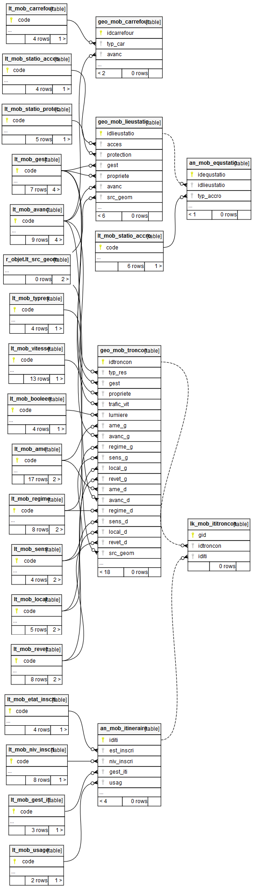

# Documentation d'administration de la base de données des mobilités douces #

## Généralité
 

## Modèle relationnel simplifié

## Schéma fonctionnel

(à venir)

## Dépendances

La base de données des aménagements cyclables s'appuie sur des référentiels préexistants constituant autant de dépendances nécessaires.

|Schéma | Table | Description | Usage |
|:---|:---|:---|:---|  
|r_objet|lt_src_geom| domaine de valeur générique d'une table géographique| référentiel utilisé pour la saisie des données|
|r_administratif|an_geo| Table attributaire contenant les codes adminsitratifs de découpage des différents périmètres officiels de l'Insee (commune, EPCI, zone d'emploi, ...)|  référentiel utilisé pour un affichage des donnéess|
|r_osm|geo_osm_epci| Table des EPCI de l'Oise au 1er janvier 2018 issu de la vue matérialisée geo_vm_osm_epci| référentiel utilisé pour un affichage des données|
|r_osm|geo_vm_osm_commune_oise| Vue matérialisée des limites communales des communes du département de l'Oise| référentiel utilisé pour la saisie des données|

---

## Classes d'objets

L'ensemble des classes d'objets unitaires sont stockées dans le schéma m_moblite_3v, celles dérivées et applicatives dans le schéma `x_apps`, celles dérivées pour les exports opendata dans le schéma `x_opendata`.

### Classe d'objet géographique et patrimoniale

`[an_mob_itineraire]` : table alphanumérique des métadonnées des objets .

|Nom attribut | Définition | Type  | Valeurs par défaut |
|:---|:---|:---|:---|  
|iditi|Identifiant unique (clé primaire) de l itinéraire|text|('I'::text || nextval('m_mobilite_3v.mob_objet_seq_id'::regclass))|
|num_iti|Numéro de l itinéraire des schémas supra-intercommunaux|character varying(10)| |
|num_loc|Numéro de l itinéraire local|character varying(10)| |
|nom_off|Nom officiel ou à défaut celui mentionné dans un document de communication grand public|character varying(100)| |
|nom_usage|Autre nom ou appellation de l itinéraire en usage|character varying(100)| |
|depart|Nom de la localité située au départ|character varying(80)| |
|via|Localité ou lieu intermédiaire entre le départ et l arrivée de l itinéraire|character varying(254)| |
|arrivee|Nom de la localité située à l arrivée|character varying(80)| |
|est_inscri|Précise si l itinéraire est inscrit à un schéma de développement des véloroutes|character varying(2)| |
|niv_inscri|Niveau administratif du schéma dans lequel l itinéraire est inscrit et numéroté|character varying(2)| |
|nom_schema|Libellé du schéma d inscription|character varying(100)| |
|an_inscri|Année d approbation du schéma dans lequel l itinéraire est inscrit et numéroté|character varying(4)| |
|an_ouvert|Indique l année d ouverture de l itinéraire|character varying(4)| |
|gest_iti|Gestion sur l itinéraire en terme d action sur les données|character varying(2)| |
|usag|Usage principal de l itinéraire|character varying(2)| |
|usage_comm|diffusion des données au grand public|boolean|false|
|voca_iti|Vocation de l itinéraire|character varying(10)| |
|typ_iti|Typologie des aménagements cyclables prévus dans le cadre d un projet d itinéraires en projet|character varying(40)| |
|mao|Maître d ouvrage de l itinéraire en projet ou en cours de travaux|character varying(100)| |
|equip|Liste d équipements potentiellement proche ou desservis par l itinéraire|character varying(5000)| |
|descrip|Description de l itinéraire (parcours, …)|character varying(5000)| |
|cout|Estimation du coût au mètre linéaire de l aménagement de l itinéraire|character varying(10)| |
|esti|Estimation en euros de l aménagement de l itinéraire|character varying(10)| |
|url_site|Lien Http vers une page web|character varying(254)| |
|observ|Commentaires|character varying(1000)| |
|op_sai|Opérateur de saisie|character varying(20)| |
|date_sai|Date de saisie de la donnée|timestamp without time zone| |
|date_maj|Date de mise à jour de la donnée|timestamp without time zone| |

Paticularité(s) à noter :
* Une clé primaire existe sur le champ `iditi` lui-même contenant une séquence d'incrémentation automatique (mob_objet_seq_id).
* Une clé étrangère existe sur la table de valeur `est_inscri` (lien vers l'identifiant `code` de la table `lt__mob_etat_inscri`).
* Une clé étrangère existe sur la table de valeur `niv_inscri` (lien vers l'identifiant `code` de la table `lt_mob_niv_inscri`).
* Une clé étrangère existe sur la table de valeur `gest_iti` (lien vers l'identifiant `code` de la table `lt_mob_gest_iti`).
* Une clé étrangère existe sur la table de valeur `usag` (lien vers l'identifiant `code` de la table `lt_mob_usage`).
*  5 triggers :
   * `t_t1_date_sai` : avant insertion, recherche la date actuelle au moment de la saisie.
   * `t_t2_date_maj` : avant mise à jour, recherche la date actuelle au moment de la mise à jour de l'objet.
   * `t_t3_iti_delete` : avant suppression, supprime les relations tronçons-itinéraire dans la table lk_mob_ititroncon.
   * `t_t4_refresh_view_after` : après suppression, rafraichit la table.
   * `t_t9_geo_mobilite_3v_log` : après insertion, mise à jour ou suppression, enregistre les modifications effectuées sur la donnée.
---

`[geo_mob_troncon]` : table géométrique .

|Nom attribut | Définition | Type  | Valeurs par défaut |
|:---|:---|:---|:---|  
|idtroncon|Identifiant unique (clé primaire) du tronçon|text| |
|id_osm|Identifiant unique du tronçon sur OpenStreetMap|character varying(30)| |
|id_on3v|Identifiant unique du tronçon sur le standard 3V|character varying(30)| |
|typ_res|Type de réseau local|character varying(2)| |
|gest|Gestionnaire de l infrastructure|character varying(2)| |
|propriete|Propriétaire de l infrastructure|character varying(2)| |
|d_service|Année de mise en service|character varying(4)| |
|trafic_vit|Vitesse maximale du trafic adjacent|character varying(2)| |
|lumiere|Présence d éclairage|character varying(1)| |
|code_com_g|Code insee de la commune à gauche de l aménagement|character varying(5)| |
|commune_g|Libellé de la commune à gauche de l aménagement|character varying(80)| |
|ame_g|Type d aménagement de gauche|character varying(2)| |
|avanc_g|Niveau d avancement en terme de projet à gauche|character varying(2)| |
|regime_g|Régime présent sur la voie de gauche|character varying(2)| |
|sens_g|Sens de circulation de l aménagement de gauche|character varying(2)| |
|largeur_g|Largeur en mètre de l aménagement de gauche|character varying(2)| |
|local_g|Localisation de l aménagement de gauche|character varying(2)| |
|revet_g|Type de revêtement du tronçon de gauche|character varying(2)| |
|code_com_d|Code insee de la commune à droite de l aménagement|character varying(5)| |
|commune_d|Libellé de la commune à droite de l aménagement|character varying(80)| |
|ame_d|Type d aménagement de droite|character varying(2)| |
|avanc_d|Niveau d avancement en terme de projet à droite|character varying(2)| |
|regime_d|Régime présent sur la voie de droite|character varying(2)| |
|sens_d|Sens de circulation de l'aménagement de droite|character varying(2)| |
|largeur_d|Largeur en mètre de l'aménagement de droite|character varying(2)| |
|local_d|Localisation de l aménagement de droite|character varying(2)| |
|revet_d|Type de revêtement du tronçon de droite|character varying(2)| |
|long_m|Longueur en mètre du tronçon|integer| |
|src_geom|Référentiel utilisé pour la digitalisation de la géométrie|character varying(2)| |
|observ|Commentaires|character varying(1000)| |
|verif|attribut spécifiant que l'utilisaetur a vérifier l exactitude du tronçon|boolean|false|
|op_sai|Opérateur de saisie|character varying(20)| |
|date_sai|Date de saisie de la donnée|timestamp without time zone| |
|date_maj|Date de mise à jour de la donnée|timestamp without time zone| |
|geom|Géométrie de l'objet|USER-DEFINED| |

Paticularité(s) à noter :
* Une clé primaire existe sur le champ `idtroncon` lui-même contenant une séquence d'incrémentation automatique (mob_objet_seq_id).
* Une clé étrangère existe sur la table de valeur `typ_res` (lien vers l'identifiant `code` de la table `lt_mob_typres`).
* Une clé étrangère existe sur la table de valeur `gest` (lien vers l'identifiant `code` de la table `lt_mob_gest`).
* Une clé étrangère existe sur la table de valeur `propriete` (lien vers l'identifiant `code` de la table `lt_mob_gest`).
* Une clé étrangère existe sur la table de valeur `trafic_vit` (lien vers l'identifiant `code` de la table `lt_mob_vitesse`).
* Une clé étrangère existe sur la table de valeur `lumiere` (lien vers l'identifiant `code` de la table `lt_mob_booleen`).
* Une clé étrangère existe sur la table de valeur `ame_g` (lien vers l'identifiant `code` de la table `lt_mob_ame`).
* Une clé étrangère existe sur la table de valeur `ame_d` (lien vers l'identifiant `code` de la table `lt_mob_ame`).
* Une clé étrangère existe sur la table de valeur `avanc_g` (lien vers l'identifiant `code` de la table `lt_mob_avanc`).
* Une clé étrangère existe sur la table de valeur `avanc_d` (lien vers l'identifiant `code` de la table `lt_mob_avanc`).
* Une clé étrangère existe sur la table de valeur `regime_g` (lien vers l'identifiant `code` de la table `lt_mob_regime`).
* Une clé étrangère existe sur la table de valeur `regime_d` (lien vers l'identifiant `code` de la table `lt_mob_regime`).
* Une clé étrangère existe sur la table de valeur `sens_g` (lien vers l'identifiant `code` de la table `lt_mob_sens`).
* Une clé étrangère existe sur la table de valeur `sens_d` (lien vers l'identifiant `code` de la table `lt_mob_sens`).
* Une clé étrangère existe sur la table de valeur `local_g` (lien vers l'identifiant `code` de la table `lt_mob_local`).
* Une clé étrangère existe sur la table de valeur `local_d` (lien vers l'identifiant `code` de la table `lt_mob_local`).
* Une clé étrangère existe sur la table de valeur `revet_g` (lien vers l'identifiant `code` de la table `lt_mob_revet`).
* Une clé étrangère existe sur la table de valeur `revet_d` (lien vers l'identifiant `code` de la table `lt_mob_revet`).
* Une clé étrangère existe sur la table de valeur `src_geom` (lien vers l'identifiant `code` de la table `lt_src_geom`).
*  5 triggers :
   * `t_t2_date_sai` : avant insertion, recherche la date actuelle au moment de la saisie.
   * `t_t3_date_maj` : avant mise à jour, recherche la date actuelle au moment de la mise à jour de l'objet.
   * `t_t4_long_m` : avant insertion ou mise à jour, calcul la taille de l'objet.
   * `t_t5_commune` : avant insertion, recherche le nom de la commune en fonction du code insee renseigné par l'utilisateur au moment de la saisie de l'objet.
   * `t_t6_refresh_view_iti` : après insertion, mise à jour ou suppression, rafraichissement des couches d'affichage des itinéraires.
---

`[geo_mob_carrefour]` : table géométrique .

|Nom attribut | Définition | Type  | Valeurs par défaut |
|:---|:---|:---|:---|  
|idcarrefour|Identifiant unique (clé primaire) du tronçon|text|('C'::text || nextval('m_mobilite_3v.mob_objet_seq_id'::regclass))|
|libelle|Libellé du carrefour|character varying(255)| |
|typ_car|Type d'aménagement|character varying(15)| |
|avanc|Niveau d avancement en terme de projet|character varying(2)| |
|insee|Code insee de la commune d implantation|character varying(5)| |
|commune|Nom de la commune d implantation|character varying(80)| |
|observ|Commentaires|character varying(1000)| |
|op_sai|Opérateur de saisie|character varying(20)| |
|date_sai|Date de saisie de la donnée|timestamp without time zone| |
|date_maj|Date de mise à jour de la donnée|timestamp without time zone| |
|geom|Géométrie de l objet|USER-DEFINED| |

Paticularité(s) à noter :
* Une clé primaire existe sur le champ `idcarrefour` lui-même contenant une séquence d'incrémentation automatique (mob_objet_seq_id).
* Une clé étrangère existe sur la table de valeur `avanc` (lien vers l'identifiant `code` de la table `lt_mob_avanc`).
* 4 triggers :
   * `t_t1_date_sai` : avant insertion, recherche la date actuelle au moment de la saisie.
   * `t_t2_date_maj` : avant mise à jour, recherche la date actuelle au moment de la saisie.
   * `t_t3_commune` : avant insertion ou mise à jour, recherche la commune via une relation spatiale.
   * `t_t9_geo_mobilite_3v_log` : après insertion, mise à jour ou suppression, enregistre les modifications effectuées sur la donnée.
---

`[geo_mob_lieustatio]` : table géométrique .

|Nom attribut | Définition | Type  | Valeurs par défaut |
|:---|:---|:---|:---|  
|idlieustatio|Identifiant unique (clé primaire) du lieu de stationnement|text|('S'::text || nextval('m_mobilite_3v.mob_objet_seq_id'::regclass))|
|id_osm|Identifiant unique du tronçon sur OpenStreetMap|character varying(30)| |
|capacite|Capacité de stationnement du lieu|integer| |
|capacite_gt|Capacité de stationnement du lieu pour des vélos de grandes tailles|integer| |
|acces|Moyen d accès au lieu|character varying(2)| |
|protection|niveau de protection du lieu|character varying(2)| |
|gratuit|Stationnement gratuit ou payant|boolean|true|
|surveillance|Présence de surveillance|boolean|false|
|couverture|Présence d un toit protégeant des intempéries|boolean|false|
|lumiere|Présence d éclairage|boolean|false|
|gest|gestionnaire de l infrastucture|character varying(2)| |
|propriete|Propriétaire de l infrastucture|character varying(2)| |
|a_service|Année d installation|character varying(4)| |
|avanc|Niveau d avancement en terme de projet|character varying(2)| |
|url|Lien vers un site d information du lieu|character varying(255)| |
|adresse|Adresse précise ou libellé de la voie d implantation du lieu de stationnement|character varying(255)| |
|cmplt_adr|Complément de l adresse d implantation du lieu de stationnement|character varying(255)| |
|insee|Code insee de la commune du stationnement|character varying(5)| |
|commune|Nom de la commune du stationnement|character varying(80)| |
|observ|Commentaire|character varying(1000)| |
|date_sai|Date de saisie de la donnée|timestamp without time zone| |
|date_maj|Date de mise à jour de la donnée|timestamp without time zone| |
|op_sai|Opérateur de saisie de la donnée|character varying(20)| |
|src_geom|Référentiel utilisé pour la digitalisation de la géométrie|character varying(2)| |
|x_l93|Coordonnée X en Lambert 93|double precision| |
|y_l93|Coordonnée Y en Lambert 93|double precision| |
|x_wgs84|Longitude|numeric| |
|y_wgs84|Latitude|numeric| |
|geom|Géométrie de la donnée|USER-DEFINED| |

Paticularité(s) à noter :
* Une clé primaire existe sur le champ `idlieustatio` lui-même contenant une séquence d'incrémentation automatique (mob_objet_seq_id).
* Une clé étrangère existe sur la table de valeur `acces` (lien vers l'identifiant `code` de la table `lt_mob_statio_acces`).
* Une clé étrangère existe sur la table de valeur `protection` (lien vers l'identifiant `code` de la table `lt_mob_statio_protec`).
* Une clé étrangère existe sur la table de valeur `gest` (lien vers l'identifiant `code` de la table `lt_mob_statio_gest`).
* Une clé étrangère existe sur la table de valeur `propriete` (lien vers l'identifiant `code` de la table `lt_mob_statio_gest`).
* Une clé étrangère existe sur la table de valeur `avanc` (lien vers l'identifiant `code` de la table `lt_mob_avanc`).
* Une clé étrangère existe sur la table de valeur `src_geom` (lien vers l'identifiant `code` de la table `lt_src_geom`).

* 7 triggers :
   * `t_t1_date_sai` : avant insertion, recherche la date actuelle au moment de la saisie.
   * `t_t2_date_maj` : avant mise à jour, recherche la date actuelle au moment de la saisie.
   * `t_t3_coord_l93` : avant mise à jour, recherche les coordonnées exactes du point en Lambert 93.
   * `t_t4_coord_longlat` : avant mise à jour, recherche les coordonnées exactes du point en Longitude et Latitude.
   * `t_t5_commune` : avant mise à jour, recherche la commune en fonction du code insee.
   * `t_t6_equ_delete` : après suppression, suppression des données liées dans la couche an_mob_equstatio.
   * `t_t9_geo_mobilite_3v_log` : après insertion, mise à jour ou suppression, enregistre les modifications effectuées sur la donnée.
---

`[an_mob_equstatio]` : table alphanumérique .

|Nom attribut | Définition | Type  | Valeurs par défaut |
|:---|:---|:---|:---|  
|idequstatio|Identifiant unique de l équipement|integer|nextval('m_mobilite_3v.an_mob_equstatio_seq_id')|
|idlieustatio|Identifiant du lieu de stationnement|text| |
|typ_mobi|Type de mobilier du lieu de stationnement|character varying(40)| |
|typ_accro|Type d accroche du lieu de stationnement|character varying(2)| |
|capacite_e|Capacité de stationnement du type d accroche|integer|0 (dans géo)|
|capacite_gt_e|Capacité de stationnement en grande taille du type d accroche|integer|0 (dans géo)|
|date_sai|Date de saisie de la donnée|timestamp without time zone| |
|date_maj|Date de mise à jour de la donnée|timestamp without time zone| |
|op_sai|opérateur de saisie de la donnée|character varying(20)|%USER_LOGIN% (dans géo)|

Paticularité(s) à noter :
* Une clé primaire existe sur le champ `idequstatio` lui-même contenant une séquence d'incrémentation automatique (an_mob_equstatio_seq_id).
* Une clé étrangère existe sur la table de valeur `typ_accro` (lien vers l'identifiant `code` de la table `lt_mob_statio_accro`).

* 4 triggers :
   * `t_t1_date_sai` : avant insertion, recherche la date actuelle au moment de la saisie.
   * `t_t2_date_maj` : avant mise à jour, recherche la date actuelle au moment de la saisie.
   * `t_t3_capacite_sum` : avant insertion, mise à jour et suppression, fait la somme des capacités des stationnement et met à jour la capacité de la table geo_mob_lieustatio.
   * `t_t9_geo_mobilite_3v_log` : après insertion, mise à jour ou suppression, enregistre les modifications effectuées sur la donnée.

---

`[lk_mob_ititroncon]` : table de relation .

|Nom attribut | Définition | Type  | Valeurs par défaut |
|:---|:---|:---|:---|  
|gid|Identifiant unique (clé primaire) de la relation|bigint|nextval('m_mobilite_3v.mob_lk_gid'::regclass)|
|idtroncon|Identifiant unique du tronçon|text| |
|iditi|Identifiant unique de litinéraire|text| |

Paticularité(s) à noter :
* Une clé primaire existe sur le champ `gid` lui-même contenant une séquence d'incrémentation automatique (mob_lk_gid).

* 2 triggers :
   * `t_t1_refresh_view_iti` : après insertion, suppressionn ou mise à jour, rafraichit la table des itinéraires.
   * `t_t9_geo_mobilite_3v_log` : après insertion, mise à jour ou suppression, enregistre les modifications effectuées sur la donnée.

---

`[an_mob_media]` : table alpanumérique .

|Nom attribut | Définition | Type  | Valeurs par défaut |
|:---|:---|:---|:---| 
|gid|Identifiant uniqueue (clé primaire) du média|bigint|nextval('m_mobilite_3v.mob_media_seq_gid'::regclass)|
|id|Identifiant de l objet référence|text| |
|media|Champ Média de GEO|text| |
|miniature|Champ miniature de GEO|bytea| |
|n_fichier|Nom du fichier|text| |
|t_fichier|Type de média dans GEO|text| |
|l_prec|Précision sur le document|character varying(1000)| |
|op_sai|Opérateur de saisie|character varying(20)| |
|date_sai|Date de saisie|timestamp without time zone| |

Paticularité(s) à noter :
* Une clé primaire existe sur le champ `qid` lui-même contenant une séquence pour l'attribution automatique d'une référence tronçon unique.

---

`[an_mob_log]` : table alpanumérique .

|Nom attribut | Définition | Type  | Valeurs par défaut |
|:---|:---|:---|:---| 
|idlog|Identifiant unique de l'opération|integer| |
|tablename|Nom de la table concernée par l'opération sur l'entité|character varying(80)| |
|type_ope|Type l'opération sur l'entité|text| |
|dataold|Valeur ancienne avant l'opération sur l'entité|character varying(10000)| |
|datanew|Valeur nouvelle après l'opération sur l'entité|character varying(10000)| |
|date_maj|Horodatage de l'opération sur la donnée aménagements cyclables|timestamp without time zone| |

Paticularité(s) à noter :
* Une clé primaire existe sur le champ `idlog`.

---

## Liste de valeurs

`[lt_mob_ame]` : Liste permettant de décrire les types d'aménagements que prennent Vélo & Territoire .   

|Nom attribut | Définition | Type  |
|:---|:---|:---|
|code|Code de la valeur|character varying(2)| |
|valeur|Libellé de la valeur des aménagements cyclables|character varying(100)| |
|url|Lien URL vers la documentation nationale|character varying(255)| |
|modele|Code du modèle d'aménagement|character varying(3)| |
|affichage|Attribut de tri pour l'applicatif Geo|integer| |

|Code | Valeur | Url | Modele | affichage |
|:---|:---|:---|:---|:---| 
|10|Non aménagé (route)|
|11|Non aménagé (jalonnement)|
|20|Piste cyclable|
|30|Bande cyclable|
|41|Double sens cyclable piste|
|42|Double sens cyclable bande|
|43|Double sens cyclable non matérialisé|
|50|Voie verte|
|60|Vélo rue|
|61|Couloir Bus+Vélo|
|62|Rampe|
|63|Goulotte|
|64|Aménagement mixte piéton-vélo (hors voie verte) (Autre Site Propre)|
|70|Chaussée à voie centrale banalisée|
|71|Accotement revêtu hors CVCB|
|99|Autre|
|ZZ|Non concerné|

Paticularité(s) à noter :
* Une clé primaire existe sur le champ `code`.
---

`[lt_mob_avanc]` : Liste permettant de décrire les différents niveaux d'avancement des aménagements .  

|Nom attribut | Définition | Type  |
|:---|:---|:---|
|code|Code de la valeur|character varying(2)| |
|valeur|Libellé de la valeur des avancements des aménagements cyclables|character varying(50)| |

|Code | Valeur |
|:---|:---|  
|00|Non renseigné|
|10|Esquisse|
|20|Avant-projet|
|30|Provisoire|
|40|En travaux|
|50|En service|
|60|Supprimé|
|70|Abandonné|
|ZZ|Non concerné|

Paticularité(s) à noter :
* Une clé primaire existe sur le champ `code`.
---

`[lt_mob_booleen]` : Liste permettant à l'utilisateur de faire un choix booléen . 

|Nom attribut | Définition | Type  |
|:---|:---|:---|
|code|Code de la valeur|character varying(2)| |
|valeur|Libellé de la valeur des faux booléens|character varying(50)| |

|Code | Valeur |
|:---|:---|  
|0|Non renseigné|
|f|Non|
|t|Oui|
|z|Non concerné|

Paticularité(s) à noter :
* Une clé primaire existe sur le champ `code`.
---

`[lt_mob_carrefour]` : Liste permettant de décrire les types de carrefours cyclables empruntés par les aménagements . 

|Nom attribut | Définition | Type  |
|:---|:---|:---|
|code|Code de la valeur|character varying(2)| |
|valeur|Libellé de la valeur des carrefours|character varying(50)| |
|modele|Code du modèle de carrefour|character varying(3)| |

|Code | Valeur | Modele |
|:---|:---|:---|  
|10|SAS vélo|
|20|Traversée|
|30|Feux aménagés|
|40|Bande d'insertion|
|50|Signalisation + présignalisation|

Paticularité(s) à noter :
* Une clé primaire existe sur le champ `code`.
---

`[lt_mob_etat_inscri]` : Liste permettant de dire si l'objet est inscrit à un schéma de développement des véloroutes  .

|Nom attribut | Définition | Type  |
|:---|:---|:---|
|code|Code de la valeur|character varying(2)| |
|valeur|Libellé de la valeur d'inscription|character varying(50)| |

|Code | Valeur |
|:---|:---|  
|00|Non renseigné|
|10|Ne sais pas (inconnu)|
|20|Non|
|30|Oui|

Paticularité(s) à noter :
* Une clé primaire existe sur le champ `code`.
---

`[lt_mob_gest]` : Liste permettant de décrire qui est le gestionnaire de l'objet . 

|Nom attribut | Définition | Type  |
|:---|:---|:---|
|code|Code de la valeur|character varying(2)| |
|valeur|Libellé de la valeur des gestionnaires|character varying(50)| |

|Code | Valeur |
|:---|:---|  
|00|Non renseigné|
|10|État|
|20|Région|
|30|Département|
|40|Intercommunalité|
|50|Commune|
|60|Privé|

Paticularité(s) à noter :
* Une clé primaire existe sur le champ `code`.
---

`[lt_mob_gest_iti]` : Liste permettant de décrire qui est le gestionnaire de l'itinéraire .

|Nom attribut | Définition | Type  |
|:---|:---|:---|
|code|Code de la valeur|character varying(2)| |
|valeur|Libellé de la valeur des gestionnaires de l'itinéraire|character varying(50)| |

|Code | Valeur |
|:---|:---|  
|10|ARC|
|20|CCPE|
|30|CCLO|

Paticularité(s) à noter :
* Une clé primaire existe sur le champ `code`.
---

`[lt_mob_local]` : Liste permettant de décrire la localisation de l'objet .

|Nom attribut | Définition | Type  |
|:---|:---|:---|
|code|Code de la valeur|character varying(2)| |
|valeur|Libellé de la valeur des localisations des aménagements|character varying(50)| |

|Code | Valeur |
|:---|:---|  
|00|Non renseigné|
|10|Trottoir|
|20|Intermédiaire|
|30|Chaussée|
|ZZ|Non concerné|

Paticularité(s) à noter :
* Une clé primaire existe sur le champ `code`.
---

`[lt_mob_niv_inscri]` : Liste permettant de décrire à quel niveau/échelle l'objet est-il inscrit . 

|Nom attribut | Définition | Type  |
|:---|:---|:---|
|code|Code de la valeur|character varying(2)| |
|valeur|Libellé de la valeur du niveau|character varying(50)| |

|Code | Valeur |
|:---|:---|  
|00|Non renseigné|
|10|Européen|
|20|National|
|30|Régional|
|40|Départemental|
|50|Intercommunal|
|60|Communal|
|70|Infracommunal|

Paticularité(s) à noter :
* Une clé primaire existe sur le champ `code`.
---

`[lt_mob_regime]` : Liste permettant de décrire le régime de la zone de l'objet .  

|Nom attribut | Définition | Type  |
|:---|:---|:---|
|code|Code de la valeur|character varying(2)| |
|valeur|Libellé de la valeur des régimes|character varying(50)| |

|Code | Valeur |
|:---|:---| 
|00|Non renseigné|
|10|Zone 30|
|20|Aire piétonne|
|30|Zone de rencontre|
|40|En agglomération|
|50|Hors agglomération|
|60|Autre|
|ZZ|Non concerné|

Paticularité(s) à noter :
* Une clé primaire existe sur le champ `code`.
---

`[lt_mob_revet]` : Liste permettant de décrire le revêtement/la texture du terrain emprunté par l'aménagement .  

|Nom attribut | Définition | Type  |
|:---|:---|:---|
|code|Code de la valeur|character varying(2)| |
|valeur|Libellé de la valeur des revêtements|character varying(50)| |
|prix_m|Prix moyen au mètre linéaire|numeric| |

|Code | Valeur | Prix_m|
|:---|:---|:---|
|00|Non renseigné|
|10|Lisse|
|11|....|
|20|Meuble|
|21|....|
|30|Rugueux|
|31|....|
|ZZ|Non concerné|

Paticularité(s) à noter :
* Une clé primaire existe sur le champ `code`.
---

`[lt_mob_sens]` : Liste permettant de décrire le sens de direction de l'aménagement .    

|Nom attribut | Définition | Type  |
|:---|:---|:---|
|code|Code de la valeur|character varying(2)| |
|valeur|Libellé de la valeur des sens de circulation|character varying(50)| |

|Code | Valeur |
|:---|:---|
|00|Non renseigné|
|10|Unidirectionnel|
|20|Bidirectionnel|
|ZZ|Non concerné|

Paticularité(s) à noter :
* Une clé primaire existe sur le champ `code`.
---

`[lt_mob_typres]` : Liste permettant de décrire le type de réseau de l'aménagement .  

|Nom attribut | Définition | Type  |
|:---|:---|:---|
|code|Code de la valeur|character varying(2)| |
|valeur|Libellé de la valeur des types de réseaux locaux|character varying(50)| |

|Code | Valeur |
|:---|:---|
|00|non renseigné|
|10|REV (Réseau Express Vélo)|
|20|STRUCTURANT|
|30|AUTRE|

Paticularité(s) à noter :
* Une clé primaire existe sur le champ `code`.
---

`[lt_mob_usage]` : Liste permettant de décrire l'usage de l'aménagement .   

|Nom attribut | Définition | Type  |
|:---|:---|:---|
|code|Code de la valeur|character varying(2)| |
|valeur|Libellé de la valeur des usages|character varying(50)| |

|Code | Valeur |
|:---|:---|
|10|Cyclable|
|20|Piéton|

Paticularité(s) à noter :
* Une clé primaire existe sur le champ `code`.
---

`[lt_mob_vitesse]` : Liste permettant de décrire la vitesse maximale à laquelle les automobilistes peuvent rouler .  

|Nom attribut | Définition | Type  |
|:---|:---|:---|
|code|Code de la valeur|character varying(2)| |
|valeur|Libellé de la valeur des vitesses de circulation|character varying(20)| |

|Code | Valeur |
|:---|:---|
|00|Non renseigné|
|10|10|
|11|15|
|20|20|
|21|25|
|30|30|
|40|40|
|50|50|
|60|60|
|70|70|
|80|80|
|90|90|
|ZZ|Non concerné|

Paticularité(s) à noter :
* Une clé primaire existe sur le champ `code`.
---

`[lt_mob_voca_iti]` : Liste permettant de décrire la vocation de l'itinéraire .

|Nom attribut | Définition | Type  |
|:---|:---|:---|
|code|Code de la valeur|character varying(2)| |
|valeur|Libellé de la valeur des vocations des itinéraires|character varying(50)| |

|Code | Valeur |
|:---|:---|
|00|Non renseigné|
|10|Loisirs|
|20|Utilitaire|

Paticularité(s) à noter :
* Une clé primaire existe sur le champ `code`.
---

`[lt_mob_statio_acces]` : Liste permettant de décrire les types d'accès aux lieux de stationnement .

|Nom attribut | Définition | Type  |
|:---|:---|:---|
|code|Code de la valeur|character varying(2)| |
|valeur|Libellé de la valeur des modes d'accès aux lieux de stationnement|character varying(50)| |

|Code | Valeur |
|:---|:---|
|00|Non renseigné|
|10|Libre accès|
|20|Abonnement ou inscription préalable|
|30|Privé|

Paticularité(s) à noter :
* Une clé primaire existe sur le champ `code`.
---

`[lt_mob_statio_accro]` : Liste permettant de décrire les types d'accroche des lieux de stationnement .

|Nom attribut | Définition | Type  |
|:---|:---|:---|
|code|Code de la valeur|character varying(2)| |
|valeur|Libellé de la valeur des accroches de stationnement|character varying(50)| |

|Code | Valeur |
|:---|:---|
|00|Non renseigné|
|10|Cadre|
|20|Roue|
|30|Cadre et roue|
|40|Sans accroche|
|99|Autre|

Paticularité(s) à noter :
* Une clé primaire existe sur le champ `code`.
---

`[lt_mob_statio_mobi]` : Liste permettant de décrire les types de mobilier des lieux de stationnement .

|Nom attribut | Définition | Type  |
|:---|:---|:---|
|code|Code de la valeur|character varying(2)| |
|valeur|Libellé de la valeur des mobiliers de stationnement|character varying(50)| |

|Code | Valeur |
|:---|:---|
|00|Non renseigné|
|10|Arceau|
|20|Ratelier|
|30|Rack double étage|
|40|Crochet|
|50|Support guidon|
|60|Potelet|
|70|Arceau vélo grande taille|
|80|Aucun équipement|
|99|Autre|

Paticularité(s) à noter :
* Une clé primaire existe sur le champ `code`.
---

`[lt_mob_statio_protec]` : Liste permettant de décrire les types de protection des lieux de stationnement .

|Nom attribut | Définition | Type  |
|:---|:---|:---|
|code|Code de la valeur|character varying(2)| |
|valeur|Libellé de la valeur des protections des stationnements|character varying(50)| |

|Code | Valeur |
|:---|:---|
|00|Non renseigné|
|10|Stationnement non fermé|
|20|Consigne collective fermée|
|30|Box individuel fermé|
|99|Autre|

Paticularité(s) à noter :
* Une clé primaire existe sur le champ `code`.
---

`[lt_loc_ame]` : Liste permettant de décrire la localisation des aménagements (droite/gauche) .

|Nom attribut | Définition | Type  |
|:---|:---|:---|
|code|Code de la valeur|character varying(2)| |
|valeur|Libellé de la valeur de la localisation des aménagements|character varying(50)| |

|Code | Valeur |
|:---|:---|
|10|Droite|
|20|Gauche|
|30|Droite et gauche|

Paticularité(s) à noter :
* cette liste est une liste statique créé dans Géo
---

### classes d'objets applicatives de gestion :
---

### classes d'objets applicatives métiers sont classés dans le schéma x_apps :

`[geo_v_mob_troncon]` : vue applicative permettant la saisie des objets dans la couche `geo_mob_troncon`.

Particularité(s) à noter :
* 3 triggers : 
   * `t_t1_modif_troncon` : avant insertion, mise à jour ou suppression, sert à mettre à jour la base de données `geo_mob_troncon`.
   * `t_t2_refresh_vmr_affiche` : avant insertion, mise à jour ou suppression, sert à rafraichir la vue matérialisée de l'affichage des tronçons.
   * `t_t9_geo_mobilite_3v_log` : après insertion, mise à jour ou suppression, enregistre les modifications effectuées sur la donnée.

---

`[geo_v_mob_noeud]` : vue d'affichage permettant la visualisation des noeuds des tronçons cyclables.

---

`[xapps_geo_v_mob_troncon_affiche]` : vue d'affichage permettant la visualisation des objets 

---

`[xapps_an_v_mob3v_tab1_apc]` : vue d'affichage permettant la visualisation de graphiques, tableaux et chiffres clés sur l'ensemble des données de l'APC (dans le schéma m_mobilite_3v).

---

`[xapps_an_v_mob3v_tab1_epci]` : vue d'affichage permettant la visualisation de graphiques, tableaux et chiffres clés sur l'ensemble des données par EPCI (dans le schéma m_mobilite_3v).

---
`[xapps_an_v_mob3v_tab2_apc]` : vue d'affichage permettant la visualisation de graphiques, tableaux et chiffres clés sur l'ensemble des données de l'APC (dans le schéma m_mobilite_3v).

---
`[xapps_an_v_mob3v_tab2_epci]` : vue d'affichage permettant la visualisation de graphiques, tableaux et chiffres clés sur l'ensemble des données par EPCI (dans le schéma m_mobilite_3v).

---
`[xapps_an_v_mob3v_tab3]` : vue d'affichage permettant la visualisation de graphiques, tableaux et chiffres clés sur le paramètre global des itinéraires (dans le schéma m_mobilite_3v).

---
`[xapps_an_v_mob3v_tab11_apc]` : vue d'affichage permettant la visualisation de graphiques, tableaux et chiffres clés sur le paramètre global des itinéraires (dans le schéma m_mobilite_3v).

---
`[xapps_an_v_mob3v_tab31]` : vue d'affichage permettant la visualisation de graphiques, tableaux et chiffres clés sur l'ensemble des données de l'APC (dans le schéma m_mobilite_3v).

---
`[xapps_an_v_mob3v_tab32]` : vue d'affichage permettant la visualisation de graphiques, tableaux et chiffres clés sur l'ensemble des données de l'APC (dans le schéma m_mobilite_3v).

---
`[geo_vmr_mob_iti]` : vue d'affichage permettant la visualisation des itinéraires.

---

`[geo_vmr_mob_triti_nonamenage]` : vue d'affichage permettant la visualisation des itinéraires non aménagés.

---

`[old_geo_vmr_mob_iti]` : ancienne vue d'affichage permettant la visualisation des itinéraires.

---

`[xapps_geo_vmr_mob_iti_deparr]` : vue d'affichage permettant la visualisation des points de départ et d'arrivée des itinéraires.

---

### classes d'objets applicatives grands publics sont classés dans le schéma x_apps_public :

Sans objet

---

### classes d'objets opendata sont classés dans le schéma x_opendata :

`[xopendata_geo_v_mob_opendata]` : vue de d'export des données

---

## Log

`[an_mob_log]` : table enregistrant les modifications effectuées sur les données.

## Erreur

`[xapps_an_v_mob_erreur]` : table d'enregistrement des erreurs obtenues pendant la saisie de donnée par les utilisateurs.

---

## Projet QGIS pour la gestion

Sans objet (uniquement un projet QGis pour le gabarit de mise à jour de l'inventaire cartographique [rubrique Gabarit du standard](https://github.com/sigagglocompiegne/espace_vert/blob/master/gabarit/livrables.md)

---

## Traitement automatisé mis en place (Workflow de l'ETL FME)

Sans objet

---

## Export Grand Public

Sans objet

---

## Export Open Data

Sans objet

